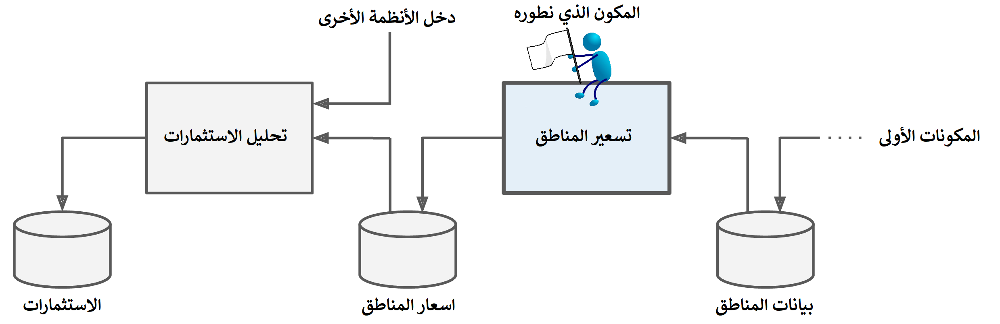

# مشروع تعلم الآلة الشامل
ستتظاهر في هذا الفصل بأنك عالم بيانات تم تعيينه مؤخراً في شركة عقارية[^1]، وعليك القيام بتنفيذ مشروع من البداية حتى النهاية، وستساعدك هذه الخطوات على تحديد خارطة الطريق إلى تنفيذ هذا المشروع:
1. ضع إطاراً عاماً للمشكلة، ثم إنظر إلى الصورة الكبيرة
2. احصل على البيانات
3. استكشف هذه البيانات واستخلص الرؤى
4. حضر هذه البيانات لعرض أنماطها الأساسية بشكل أفضل لخوارزميات تعلم الآلة
5. جرب عدة نماذج وخوارزميات وأعد قائمة مختصرة للنماذج الأفضل
6. اضبط متغيرات النموذج ثم ادمجه في النظام الكامل
7. اعرض النموذج والنظام
8. أطلق، وراقب النموذج ثم اعمل على صيانته باستمرار

## العمل على بيانات حقيقية
سنعمل على بيانات من العالم الحقيقي أثناء عملنا على تعلم أي شيء عن تعلم الآلة فذلك أفضل لربط الأفكار ببعضها، ولحسن الحظ يمكننا الاختيار من الكثير من مجموعات البيانات المفتوحة المصدر في كافة المجالات، وهنا بعض المصادر التي يمكنك البحث فيها للحصول على بيانات مناسبة لمشروعك:
* مستودعات البيانات المفتوحة الشائعة
 - [UC Irvine Machine Learning Repository](http://archive.ics.uci.edu/ml/index.php)
 - [Kaggle datasets](https://www.kaggle.com/datasets)
 - [Amazon’s AWS datasets](https://registry.opendata.aws/)
* Meta Portal - فيها العديد من مستودعات البيانات المفتوحة
 - http://dataportals.org/
 - http://opendatamonitor.eu/
 - http://quandl.com/
* مصادر أخرى تحتوي العديد من مستودعات البيانات المفتوحة والمشهورة
 - [Wikipedia’s list of Machine Learning datasets](https://en.wikipedia.org/wiki/List_of_datasets_for_machine-learning_research)
 - [Quora.com question](https://www.quora.com/Where-can-I-find-large-datasets-open-to-the-public)
 - [Datasets subreddit](https://www.reddit.com/r/datasets/)

اخترنا في هذا الفصل مجموعة بيانات أسعار الإسكان في كاليفورنيا من مستودع StatLib[^2] (إنظر الشكل *). استندت هذه المجموعة إلى بيانات التعداد السكاني لكاليفورنيا عام 1990، فلا تعد هذه المجموعة حديثة لكنها تحوي العديد من الصفات التي تجعلها جيدة لغرض التعلم ولذلك سنتظاهر بأنها حديثة، إضافة أننا حذفنا منها بعض الحقول وقمنا بإضافة أخرى لأغراض الدراسة.

## الخطوة 1: ضع إطاراً عاماً للمشكلة، ثم إنظر إلى الصورة الكبيرة
مرحباً بكم في شركة إسكان تعلم الآلة، ستكون مهمتك الأولى بناء نموذج لأسعار المساكن في كاليفورنيا باستخدام بياناتها للتعداد السكاني. تحتوي هذه البيانات على حقول قياسات مثل عدد السكان، متوسط الدخل، متوسط سعر السكن، و... لكل مجموعات الكتل السكانية في كاليفورنيا، مجموعات الكتل السكانية هي اصغر وحدة جغرافية ينشر لها مكتب الاحصار الأمريكي عينات من البيانات ويبلغ تعداد مجموعة الكتل في العادة بين 600 و 3000 شخص، وسنسميها اختصاراً مناطق.

يجب أن يتعلم نموذجك من هذه البيانات ويكون قادراً على التنبؤ بمتوسط سعر السكن في أي منطقة بالنظر إلى جميع الحقول الأخرى.

**تلميح** إذا أردت ان تكون عالم بيانات منظم فيجب عليك البدء بقائمة خطوات مشروع تعلم الآلة، إبدء بتلك الموجودة [هنا]() ستغطي جيداً معظم مشاريع تعلم الآلة لكن لا يمنع من تعديلها حسب حاجتك. سنتناول في هذا الفصل معظم عناصر هذه القائمة وسنتخطى بعضها، إما لأنها تشرح نفسها بوضوح أو لأننا سنقوم بتغطيتها بأماكن أخرى.

### تأطير المشكلة
اسأل مديرك أولاً عن الهدف من هذا العمل، فبناء النموذج غالباً لن يكون هو الهدف النهائي. فكيف تتوقع الشركة استخدام هذا النموذج والاستفادة منه؟ ستساعد هذه الأسئلة على تأطير المشكلة وتحديد الخوارزميات المناسبة لحلها، إضافة إلى مقياس الأداء الذي سنقيم به النموذج، وكمية الجهد والتركيز المبذولين في إنشاء وتعديل هذا النموذج.

سيجيب مديرك في هذا الحالة بأن خرج نموذجك - توقع متوسط سعر السكن في المنطقة - سيكون دخل إلى نظام تعلم ألة آخر (انظر الشكل *)، إلى جانب العديد من قيم النماذج الآخرى. وسيحدد هذا النظام الآخير جدوى الاستثماء في منطقة معينة أم لا، والحصول على هذا الجواب بشكل صحيح أمر بالغ الأهمية، لأنه يؤثر بشكل مباشر على الإيرادات.

#### خطوط التنفيذ
يطلق على سلسلة من مكونات معالجة البيانات اسم خط التنفيذ. وهو شائع جداً في أنظمة تعلم الآلة، نظراً لوجود كميات ضخمة من البيانات التي يجب معالجتها والعديد من مكونات معالجة وتحويل البيانات التي يجب تطبيقها. تعمل المكونات بشكل غير متزامن أغلب الأحيان. يسحب كل مكون كمية كبيرة من البيانات، ويعالجها، ويبث النتيجة في مخزن بيانات منفصل، ثم بعد مرور بعض الوقت، يسحب المكون التالي في خط التنفيذ هذه البيانات ليعالجها ويبث النتيجة مرة أخرى إلى مخزن بيانات آخر، وهكذا دواليك كل مكون قائم بذاته إلى حد ما، وتكون واجهة تبادل البيانات بين هذه المكونات هي مخزن البيانات نفسه ما يجعل النظام سهل الفهم، ويمكّن الفرق المختلفة من العمل على المكونات المختلفة باستقلالية تامة، علاوة على أن تعطل أحد المكونات لا يعني تعطل النظام كاملاً على الأقل لفترة من الزمن، وهذا ما يجعل من خطوط التنفيذ بنية قوية للغاية. لكن من الناحية الأخرى قد لا يتم ملاحظة تعطل أحد المكونات حتى يمر بعض الوقت عندما لا يكون هناك نظام مراقبة على خط التنفيذ ما يعني انخفاض في اداء النظام بشكل عام حيث أن البيانات تصبح قديمة بعض الشيء.

اسأل مديرك ثانياً عن شكل الحل الحالي إن وجد، فغالباً ما يمنحك مرجعاً لجودة الحل المطلوب ويزودك برؤية حول كيفية حل المشكلة. وسيجيب مديرك في هذه الحالة أن أسعار المساكن في المنطقة يتم تقديرها يدوياً من قبل الخبراء، حيث يقوم فريق بجمع آخر المعلومات عن المنطقة، وعندما لا يتمكنون من الحصول على متوسط سعر السكن، فيقوم الخبراء بتقدير السعر باستخدام الكثير من القواعد المعقدة الغير مكتوبة. كما يتضح فإن هذه الطريقة مكلفة وتستغرق وقتاً طويلاً ولا تعطي تقديرات جيدة، حيث أنه حتى في الحالات التي يتمكن فريق الخبراء فيها من معرفة متوسط سعر السكن الفعلي فغالباً ما يدرك بعد ذلك أن تقديراته كانت اقل بـ 20% من الحقيقة. هذا هو سبب اعتقاد الشركة أنه سيكون من المفيد تدريب نموذج للتنبؤ بمتوسط سعر السكن للمنطقة بالنظر إلى البيانات العقار الآخرى الخاصة بهذه المنطقة. وهنا تبدو بيانات التعداد السكاني كمجموعة بيانات رائعة للإستفادة منها لهذا الغرض، لأنها تتضمن متوسط أسعار المساكن لألاف المناطق بالإضافة إلى بيانات اخرى عن مواصفات المساكن.

[^1]: هدف هذا المثال هو بناء مشروع يوضح الخطوات الرئيسية لمشروع تعلم الآلة، وليس معرفة أي شيء عن الأعمال العقارية
[^2]: جائت مجموعة البيانات هذه لأول مرة في رسائل الإحصار والأحتمالات عام 1997 لكلا من R. Kelley Pace and Ronald Barry