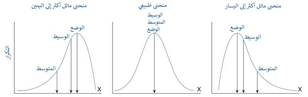

# مفاهيم الإحصاء الأساسية لعلوم البيانات
بلغة بسيطة وأمثلة سهلة

الإحصاء: هو” أحد فروع الرياضيات، يعمل على جمع وتحليل وتفسير وعرض البيانات الرقمية“. وتأتي الوصفة السحرية للمهارات الأساسية لعلوم البيانات من مزجه بالبرمجة وتعلم الآلة.

يُستخدم الإحصاء في تحليل وتحويل وتنظيف البيانات، بالإضافة إلى تقييم وتحسين خوارزميات تعلّم الآلة، كما يُستخدم في عرض المخططات والنتائج إضافة إلى ما تبرزه تلك النتائج من رؤى، أي يمكننا القول أنّه يُستخدم في معظم جوانب علم البيانات.

تحديد ما تحتاج لتعلّمه بالضبط في مجال الإحصاء قد يكون صعباً للغاية، حيث أنّه يعد من المجالات الواسعة للغاية، بالإضافة إلى ذلك فإنّ الكثير من المواد التعليمية في هذا الموضوع معقّدة وفي بعض الحالات يصعب استيعابها، خاصة إذا لم تكن لديك درجة علمية في الرياضيات وقد بدأت تعلّم علوم البيانات من خلفية في هندسة البرمجيات.

سأتكلّم في هذا المقال عن ثمانية مفاهيم إحصائية أساسية يجب أن تكون قادرًا على فهمها عند البدء في مجال علوم البيانات، وهي مجموعة مختارة للمتطلّبات الأساسية التي تحتاج إلى معرفتها قبل البدء في تعلّم الطرق والتقنيات الأكثر تعقيدًا في هذا المجال.

## 1. أخذ العينات الإحصائية:
تُعرف مجموعة البيانات الأولية الكاملة التي قد تكون متوفرة لديك لإجراء اختبار أو تجربة ما عليها في الإحصاء باسم ”المجتمع الإحصائي“. وحيث أن هناك العديد من الأسباب التي تمنع اكتشاف الأنماط والاتجاهات على المجتمع ككل، يقدّم الإحصاء إمكانية أخذ عينة من هذا المجتمع وإجراء الحسابات عليها ومن خلال اللجوء إلى الاحتمالات وبعض الفرضيات يمكننا فهم اتجاهات هذا المجتمع والتنبؤ بأحداثه المستقبلية بدرجة مقبولة من الدقّة.

لنفترض مثلاً أنّنا نريد أن نفهم مدى انتشار مرض مثل سرطان الثدي في دولة ما، فلأسباب عملية لا يمكننا فحص جميع سكان تلك الدولة، وبدلاً من ذلك نقوم بأخذ عينة عشوائية من السكان ونقوم بفحص انتشار هذا المرض بينهم، وبافتراض أنّ هذه العينة عشوائية بما فيه الكفاية وتمثّل جميع السكان نستطيع إنشاء مقياس لانتشار هذا المرض.

## 2. الإحصاء الوصفي:
كما يوحي اسمه، فإنّه يساعدنا على وصف البيانات؛ بمعنى أنّه يُمكّننا من فهم الخصائص الأساسية لها، لا يتنبّأ الإحصاء الوصفي أو يضع افتراضيات أو يستنتج أي شيء، إنّه ببساطة يوفّر وصفاً لما تبدو عليه عينة البيانات التي لدينا.

تُحسب معاملات الإحصاء الوصفي من العمليات الحسابية المشهورة، مثل:

- **المتوسط** أو القيمة المركزية.
- **الوسيط** هو القيمة المتوسطة للبيانات بعد ترتيبها من الأدنى إلى الأعلى.
- **الوضع** هو القيمة الأكثر تكراراً في العينة.

## 3. التوزيعات:
بقدر ما للإحصاء الوصفي من أهمية بقدر ما يخفي من معلومات حول العينة المدروسة، فعلى سبيل المثال: إذا كانت مجموعة البيانات تحتوي على عدّة أرقام أكبر بكثير من الأرقام الأخرى، فسيأتي المتوسط منحرفًا ولن يعطي تمثيلًا حقيقيًا لتلك العينة من البيانات.

**التوزيع**: هو مخطط مدرّج تكراري على الغالب، يعرض القيمة وعدد مرات تكرارها في العينة، ويقدّم هذا النوع من المخططات معلومات أفضل حول انتشار وانحراف البيانات.

يكون الشكل البياني للتوزيع عادةً على شكل منحنى، قد ينحرف أكثر إلى اليمين أو اليسار:

  

 
يُعد التوزيع الطبيعي أحد أهم التوزيعات، ويُشار إليه عادةً بمنحنى الجرس نظراً لشكله المتماثل حيث تتجمّع معظم القيم حول قيمة المتوسط ثم تأتي القيم البعيدة موزعة بالتساوي على كل جانب من جوانب المنحنى. تشكّل العديد من الظواهر الطبيعية توزيعًا طبيعيًا، مثل أطوال الأشخاص ومعدّلات ذكائهم وهكذا.

## 4. الاحتمالات:
**الاحتمال**: هو نسبة وقوع حدثٍ ما، وفي الإحصاء هو نتيجة أي تجربة كإلقاء حجر نرد، أو نسبة توجُّه المستخدمين في A/B Testing.

يُحسب الاحتمال لحدثٍ ما بقسمة عدد الأحداث على عدد النتائج الإجمالية الممكنة، وفي حالة حجر النرد سيكون احتمال ظهور الرقم 3 عند رميه هي 1/6=0.167، يتم التعبير عن النتيجة كنسبة مئوية 16.7% أحيانًا.

تأتي الأحداث على نوعين: **مستقلة** أو **تابعة (شرطية)**، في الأحداث التابعة أو الشرطية يؤثر حدث سابق على الحدث اللاحق؛ لنفترض أنّ لدينا كيسًا يحوي حلوى الـ M&Mوأردنا تحديد احتمال ظهور حبة حمراء، فإذا قمنا في كل مرة بسحب حبة من الكيس وأكلها (يعني أنّنا لم نعدها إلى الكيس) فإنّ احتمال ظهور حبات حمراء سيتغيّر في المستقبل لأنّ عدد الحبات سيقل أي أنّ الحدث التالي سيتأثر بالأحداث السابقة.

  

 
 ولا تتأثّر الأحداث المستقلة بالأحداث السابقة، ففي حالة كيس حلوى الـ M&M، إذا سحبنا حبة وقمنا بإعادتها إلى الكيس، سيظل احتمال اختيار اللون الأحمر كما هو في كل مرة، وذلك لأنّنا لم نأكل الحبة  أي عدد الحبات الكلي سيبقى نفسه في كل مرة.

تأتي أهمية تحديد نوعية الحدث مستقلًا أم تابعًا من أنّ الطريقة التي نحسب بها احتمالية وقوع أحداث متعددة ستختلف من نوع إلى آخر.

نحسب احتمال وقوع أحداث مستقلة متعددة بضرب احتمال وقوع كل حدث على حِدَة، ففي مثال إلقاء حجر النرد سيكون احتمال ظهور الرقم خمسة لثلاث رميات كما يلي:

احتمال ظهور الرقم خمسة في المرة الأولى: 1/6 = 0.167
احتمال ظهور الرقم خمسة في المرة الثانية: 1/6 = 0.167
احتمال ظهور الرقم خمسة في المرة الثالثة: 1/6 = 0.167
الاحتمال الاجمالي: 0.167 * 0.167 * 0.167 = 0.005

سيختلف الحساب في الأحداث التابعة أو الشرطية، وبالرجوع إلى مثال كيس حلوى الـ M&M تخيّل أنّ الكيس فيه لونين فقط 3 حبات حمراء، وحبّتان صفراوان، ونريد حساب احتمال سحب حبتين حمراء على التوالي، عند السحب الأول يكون احتمال ظهور حبة حمراء هو 3/5=0.6، لكن عند السحب الثاني — بما أنّنا لم نعد الحبة إلى الكيس — سيكون احتمال ظهور حبة حمراء هو 2/4=0.5، بالتالي فإنّ احتمال ظهور حبتين حمراوين على التوالي هو 0.6*0.5=0.3

## 5.التحيُّز:
تُستخدم العينات في الإحصاء لإجراء تقديرات حول مجموعة البيانات بأكملها، وكذلك في نماذج التنبؤ فإنّنا نقوم باستخدام بعض بيانات التدريب (عينة منها) ونحاول بناء نموذج يمكنه التنبؤ بالبيانات الجديدة.

يَنتج التحيُّز من ميل النموذج — إحصائيًا كان أو تنبؤيًا — إلى المبالغة في التقدير أو التقليل من شأن جزء من البيانات، وغالبًا ما يكون السبب هو الطريقة المستخدمة في الحصول على عينة البيانات، أو طريقة قياس الأخطاء.

هناك عّدة أنواع شائعة من التحيُّز في علم الإحصاء، وهنا نوعان:

1. **تحيُّز الاختيار**: يحدث عندما يتم اختيار العينة بطريقة غير عشوائية، بالعودة إلى مثال A/B ،Testing  فإذا تم إيقاف الاختبار مبكّرًا فإنّ العينة لن تحتوي على التأثيرات الموسمية، ممّا يجعل النموذج عاجزًا عن التنبؤ خلال هذه المواسم.
2. **تحيُّز التأكيد**: يحدث عندما يكون لدى عالِم البيانات افتراض مسبق عن البيانات، ففي هذه الحالة سيميل لقضاء وقت أطول محللًا حقول البيانات ومحاولًا تأكيد فرضياته المسبقة.

### التباين:
رأينا سابقاً أنّ المتوسط في عينة من البيانات هو القيمة المركزية، ويقيس التباين مدى بُعد كل قيمة من قيم العينة عن هذا المتوسط، ويعبّر التباين في الأساس عن مدى انتشار القيم في مجموعة ما حول متوسطها.

### الانحراف المعياري:
هو المقياس الشائع للتباين في البيانات التي تتوزع طبيعيًا (على شكل جرس)، إنّه عملية حسابية تعطي النطاق الذي تتوزّع فيه قيم العينة، لذا فإنّ الانحراف المعياري المنخفض يعني أنّ القيم تميل إلى الاقتراب من المتوسط، بينما يشير الانحراف المعياري العالي إلى انتشار القيم بشكل أكبر بعيدًا عن المتوسط.

هناك مقاييس تباين أخرى للبيانات التي لا تتبع التوزيع الطبيعي، وعادةً ما يُستخدم **النطاق الربيعي**، وذلك بترتيب البيانات من الأدنى إلى الأعلى ثم تقسيمها إلى أربعة أجزاء متساوية، تُسمّى "رباعية"، يمثل كل ربع مكان تواجه الـ 25% من البيانات بالنسبة إلى الوسيط، ثم يُحسب الوسيط الربيعي عن طريق طرح وسيطي الربع الأول والثالث Q1 وQ3.

## 6. التوازن بين التحيُّز والتباين
يُعتبر التحيُّز والتباين من المفاهيم المهمة في تعلّم الآلة؛ فعند بناء نموذج تعلّم آلة نستخدم عينة من البيانات تُعرف باسم "مجموعة التدريب"، يتعلّم النموذج الأنماط الموجودة في هذه العينة ويولد دالة رياضية قادرة على إعطاء الخرج أو القيمة المستهدفة الصحيحة لكل مجموعة من البيانات على دخلها.

عند إنشاء دالة التنبؤ تلك، سيستخدم النموذج مجموعة من الفرضيات للحصول على أفضل تقريب لقيمة الخرج: وعلى سبيل المثال: تفترض خوارزمية الانحدار الخطي وجود علاقة خطية (خط مستقيم) بين المدخلات والقيمة المستهدفة (الخرج)، وهذه الفرضية تعني تحيُّزًا ضد أي قيمة غير خطية مع الخرج.

التحيُّز — حسابيًا —: هو الفرق بين متوسط القيم التي تنبّأ بها النموذج والقيم الحقيقية.

وستتباين قيم التنبؤات القادمة من النموذج إذا تم استخدام مجموعة تدريب مختلفة في كل مرة، ففي تعلّم الآلة يُعتبر التباين مقياسًا لمدى ضخامة هذا الاختلاف.

يُشكّل التحيُّز والتباين في تعلّم الآلة الخطأ الإجمالي المتوقع لتنبؤات النموذج، وإذا كان التحيُّز والتباين منخفضَين فسنكون في الحالة المثالية، لكن تقليل التحيُّز سيؤدّي عادةً إلى زيادة التباين، والعكس صحيح. وتصف موازنة خطَأَي التحيُّز والتباين عملية تقليل الخطأ الكلي للنموذج.

## 7. الارتباط:
يقيس الارتباط العلاقة بين متغيرَين (حقلَين)، ويفترض أن يكون خطيًا (يُشكّل خطًا عند عرضه في رسم بياني) ويُعبّر عنه كرقم بين +1 و-1 ويُسمّى هذا الرقم "بمعامل الارتباط".

كلما اقترب معامل الارتباط من +1 يكون إيجابيًا وقويًا ويعني أنّ زيادة قيمة المتغير الأول تؤدي إلى زيادة قيمة المتغير الثاني، وإذا اقترب من 0 فيعني عدم وجود ارتباط بين المتغيرَين، أمّا إذا اقترب المعامل من -1 فهذا يعني ارتباطًا سلبيًا وقويًا أيضًا بمعنى أنّ أي زيادة في المتغير الأول يقابلها نقصان في المتغير الثاني.

قصدتُ في هذه المقالة تقديم موجز لبعض الأساليب الإحصائية المستخدمة بكثرة في علم البيانات، فالإحصاء مجال واسع ومعقّد، وغالبًا ما تتطلّب دورات علوم البيانات معرفة مسبقة بهذه المفاهيم الأساسية، أو تبدأ بشرح هذه المفاهيم بطريقة سريعة يصعب استيعابها.

أرجو أن أكون قد سلّطتُ الضوء على المجموعة الأهم من التقنيات الإحصائية الأساسية في علم البيانات التي ستفيدك قبل الانتقال إلى المواضيع الأكثر تقدّماً.

شكراً على القراءة

