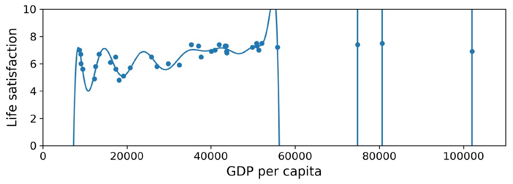
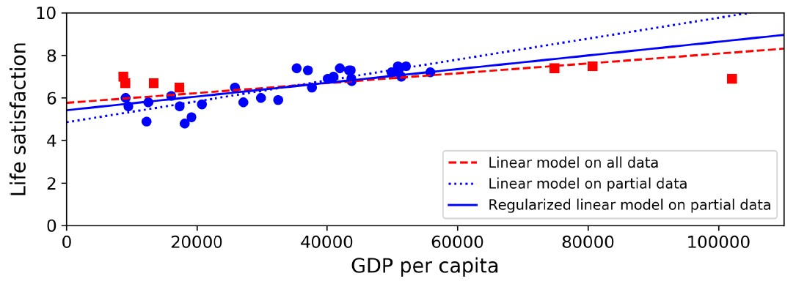

# هل يصنع المال السعادة؟

للإجابة على هذا السؤال سنقوم بجلب بيانات مؤشر الحياة الأفضل من [موقع](https://stats.oecd.org/index.aspx?DataSetCode=BLI) منظمة التعاون الاقتصادي والتنمية، وسنجلب ايضاً احصائيات حول نصيب الفرد من الناتج المحلي الإجمالي من [موقع](https://www.imf.org/en/Publications/SPROLLS/world-economic-outlook-databases) صندوق النقد الدولي. ثم سنقوم بجمع الجداول على بعضها ونرتب النتيجة حسب عمود نصيب الفرد من الناتج المحلي الإجمالي، ستجد في الجدول 1-1 جزءاً من الجدول الأخير.


هذا رسم بياني لمجموعة صغيرة وعشوائية من البلاد الشكل 1-17


دقق في الرسم البياني لتجد اتجاه خطياً عاماً للبيانات على الرغم من وجود بعض الضوضاء (أي ان البيانات عشوائية جزئياً بالنسبة لخط مستقيم) ويبدو أن الرضا عن الحياة يرتفع بشكل خطي إلى حد ما مع زيادة نصيب الفرد من الناتج المحلي الاجمالي في البلاد. لذلك قررنا أن ننمذج الرضا عن الحياة كدالة خطية مع نصيب الفرد من الناتج المحلي الاجمالي، تسمى هذه الخطوة اختيار النموذج، حيث قمنا باختيار نموذجاً خطياً للرضا عن الحياة بميزة واحدة فقط هي نصيب الفرد من الناتج المحلي الاجمالي، إنظر المعادلة 1-1

المعادلة 1-1 نموذج خطي بسيط
$جودة_الحياة = theta_0 + theta_1 * نصيب_الفرد_من_الناتج_المحلي_الاجمالي$

يحتوي هذا النموذج على معاملين (برامترين) $theta_0 theta_1$[^1]، ويمكننا نمذجة أي خط مستقيم من خلال تعديل هذين المعاملين، إنظر النموذج 1-18


نحتاج ان نحدد افضل قيم لمعاملي النموذج قبل استخدامه، لكن السؤال هو كيف يمكننا تحديد هذه القيم بأفضل طريقة ممكن، يأتي الجواب من تحديد مقياس الأداء. ولتحديد هذا المقياس نستطيع الإعتماد على **دالة المنفعة** والتي تقيس مدى جودة النموذج، أو الاعتماد على **دالة التكلفة** التي تقيم مدى سوء النموذج. يستخدم العلماء لمشاكل الانحدار الخطي عادة دالة التكلفة التي تقيس المسافة بين تنبؤات النموذج الخطي وأمثلة التدريب الحقيقة، عندها يكون الهدف هو تقليل هذه المسافات إلى الحد الأدنى.

يأتي دور خوارزمية الانحدار الخطي الآن، حيث نقوم بإعطائها أمثلة التدريب الحقيقة وتقوم هي بإيجاد النموذج الخطي الأنسب لتلك البيانات. هل لاحظت الفرق بين الخوارزمية والنموذج؟ فخوارزمية الانحدار الخطي هي مجموعة الخطوات التي نسلكها لإيجاد أفضل قيم (تدريب الآلة) لمعاملي الخط المستقيم $theta_0 theta_1$ بينما النموذج هو قيم هذه المعاملات التي وجدناها. وجدت الخوارزمية أن القيم الأنسب هي $theta_0=4.85 theta_1=4.91*10^-5$

إنظر الشكل 1-19 لترى كيف أن الخط المستقيم المرسوم يتناسب مع اتجاه البيانات العام، ويمثل هذا الاتجاه بشكل مقبول.


  نحن جاهزون الآن لتشغيل النموذج وتوليد التنبؤات، كمثال لنفترض أننا نريد معرفة درجة رضا القبراصة عن حياتهم، وأن بيانات منظمة التعاون الاقتصادي والتنمية لا تحتوي الإجابة.

نستطيع التنبؤ برضا القبارصة بجودة معقولة باستخدام نموذجنا الخطي: نبحث عن نصيب القبرصي من الناتج المحلي الاجمالي، فنجده 22,587 دولاراً، نعوض هذه القيمة في المعادلة الخطية لنجد رضا القبارصة عن حياتهم بحلها $4.85 + 22,587 × 4.91 × 10-5 = 5.96$

إنظر إلى الكود 1-1 لإشباع فضولك، فهو يقوم بتحميل البيانات، ويحضرها لتدريب النموذج[^2]، ثم يرسم شكلاً بيانياً للبيانات ليعطينا تصوراً عنها، ثم يدرب النموذج الخطي، ويتنبئ بالرضا عن الحياة بالنهاية[^3].

```python
import matplotlib.pyplot as plt
import numpy as np
import pandas as pd
import sklearn.linear_model

# Load the data
oecd_bli = pd.read_csv("oecd_bli_2015.csv", thousands=',')
gdp_per_capita = pd.read_csv("gdp_per_capita.csv",thousands=',',delimiter='\t', encoding='latin1', na_values="n/a")

# Prepare the data
country_stats = prepare_country_stats(oecd_bli, gdp_per_capita)
X = np.c_[country_stats["GDP per capita"]]
y = np.c_[country_stats["Life satisfaction"]]

# Visualize the data
country_stats.plot(kind='scatter', x="GDP per capita", y='Life satisfaction')
plt.show()

# Select a linear model
model = sklearn.linear_model.LinearRegression()

# Train the model
model.fit(X, y)

# Make a prediction for Cyprus
X_new = [[22587]] # Cyprus' GDP per capita
print(model.predict(X_new)) # outputs [[ 5.96242338]]
```
المثال 1-1 تدريب وتشغيل نموذج خطي باستخدم Scikit-Learn

إذا استخدمنا خوارزمية تعليم قائمة على المثال بدلاً من تلك القائمة على النموذج، فسنجد أن سلوفينيا لديها أقرب نصيب للفرد من الناتج المحلي الاجمالي لقبرص 20,732 دولاراً، وبما أن بيانات منظمة التعاون الاقتصادي والتنمية تخبرنا أن رضا السلوفينيين عن الحياة هو 5,7 فقد يكون تنبؤ رضا القبارصة عن حياتهم هو 5,7. إذا قمنا بالتصغير قليلاً لننظر إلى أقرب بلدين تاليين، فسنجد البرتغال واسبانيا مع قيم رضا عن الحياة 5,1 و 6,5 على التوالي، وعند حساب متوسط هذه القيم نحصل على 5,77 وهو قريب جداً من التوقعنا بناء على النموذج. تسمى هذه الخوارزمية البسيطة إنحدار الجيران الأقرب المعدودة في هذا المثال عددنا 3 جيران فقط أي k=3. لتجربة هذا النموذج قم باستبدال نموذج الانحدار الخطي بإنحدار الجيران الأقرب المعدودة في الكود السابق كما يلي

استبدل هذين السطرين
```python
import sklearn.linear_model
model = sklearn.linear_model.LinearRegression()
```
بهذين السطرين
```python
import sklearn.neighbors
model = sklearn.neighbors.KNeighborsRegressor(n_neighbors=3)
```
إذا سارت الأمور على مايرام فسيقوم النموذج بعمل تنبؤات جيدة، وإلا فقد نحتاج إلى استخدام المزيد من الميزات (مثل معدل التوظيف، الصحة، تلوث الهواء، إلخ) أو قد نحتاج إلى بيانات تدريب أكثر أو أجود، أو ربما نحتاج إلى نموذج أقوى على سبيل المثال نموذج انحدار متعدد الحدود.

ملخص ما عملنا عليه
* دراسنا بيانات التدريب
* حددنا النموذج المناسب
* دربنا النموذج على بيانات التدريب (حيث بحثت الخوارزمية عن قيم معاملات النموذج التي تجعل دالة الكلفة بأقل قيمة ممكنة)
* استخدمنا النموذج لعمل التنبؤات على الحالات الجديدة (هذا ما يسمى بالاستدلال) على أمل أن يتم تعميم النموذج بشكل جيد.

هذا مايبدو عليه مشروع تعلم الآلة النموذج باختصار، وسنتعلم عنه لاحقاً بالتفصيل عن تنفيذ مشروع كامل

قمنا بتغطية الكثير من الجوانب حتى الآن فنحن نعرف الآن ما يعنيه أن الآلة تتعلم حقيقة، ولماذ يكون مفيداً أن تتعلم الآلة، وما هي أنوع تعلم الآلة الأكثر شيوعاً، وكيف يبدو سير عمل المشروع تعلم الآلة النموذجي.
وسنتعلم لاحقاً عن التحديات التي قد نواجهها في تعليم الآلة والتي قد تمنعنا من اجراء تنبؤات دقيقة.


# تحديات تعليم الآلة الرئيسية
كما رأينا سابقاً وباختصار فإن مهمتنا هي تحديد خوارزمية التعلم وتدريبها على بيانات التدريب، لذا فإن الشيئين اللذين يمكن أن تأتي منهم الأخطاء هما خوارزمية سيئة أو بيانات سيئة، وسنبدأ بأمثلة عن البيانات السيئة.

## 1. كمية بيانات التدريب غير كافية
يتعلم الطفل تميز التفاحة بمجرد الإشارة إلى إحداها وترديد كلمة "تفاحة" عدة مرات، ثم يصبح الطفل قادر على التعرف على جميع أنواع التفاح بألوانه وأشكاله المختلفة، هذا هو الذكاء البشري. لكن تعلم الآلة لم يصل إلى هذا الحد بعد، وتتطلب معظم خوارزميات تعليم الآلة الكثير من البيانات لتعمل بشكل صحيح، حتى بالنسبة للمشكلات البسيطة جداً، فنحن بحاجة إلى آلاف الأمثلة عادة، أما بالنسبة إلى المشكلات الأكثر تعقيداً مثل التعرف على الصور أو الكلام، فقد نحتاج إلى ملايين الأمثلة، (إلا إذا كان بالإمكان إعادة استخدام أجزاء من نموذج مدرب مسبقاً).

### فعالية البيانات غير المفهومة
بيّن الباحثين من مايكروسوفت مايكل بانكو وإريك بريل في [بحث](https://dl.acm.org/doi/10.3115/1073012.1073017) مشهور نشر عام 2001 أن مجموعة من خوارزميات تعليم الآلة المختلفة تتضمن خوارزميات بسيطة إلى حد ما تعمل جيداً على مشكلة معقدة تتعلق بإلغاء غموض[^4] اللغة الطبيعية بمجرد إعطائها كمية كافية من بيانات، إنظر الشكل-1-20

![الشكل 1-20 أهمية البيانات مقابل الخوارزميات[^5]](assets/figure-1-20.jpg)

يقول المؤلفان أن نتائجهما تشير إلى أنه يجب اعادة النظر وانفاق الوقت والمال على جمع البيانات بدلاً من تطوير الخوارزميات.

أشارت ورقة بحثية كتبها بيتر نورفيغ عام 2009 بعنوان ["فعالية البيانات غير المفهومة"](https://static.googleusercontent.com/media/research.google.com/en//pubs/archive/35179.pdf) أن البيانات مهمة أكثر من الخوارزميات للمشكلات المعقدة، ومن الجدير بالذكر أن مجموعات البيانات الصغيرة والمتوسطة الحجم لا تزال شائعة الاستخدام وليس من السهل أو الرخيص الحصول على بيانات تدريب اضافية، لذلك لم نتخلى عن تطوير الخوارزميات حتى الآن.

## 2. بيانات التدريب التي لا تمثل المشكلة
يجب أن تمثل بيانات التدريب كافة حالات المشكلة الحالية والجديدة، من اجل التعميم بشكل جيد. أي بناء نموذج يعمم ما تعلمه على كافة الحالات المستقبلية، وينطبق هذا الشرط على نوعي الخوارزميات القائمة على النموذج أو تلك القائمة على المثال.

سأفشي لك سراً، هو أن مجموعة البلاد التي دربنا نموذجنا الخطي عليها سابقاً لم تكن تمثل المشكلة تماماً، فقد تم اخفاء عدد قليل من البلدان، إنظر الشكل-1-21 لترى كيف تبدو البيانات عند اضافة البلدان التي اخفيت.


سنحصل على الخط المتصل عند تدريب نموذج خطي على هذه عينة البيانات الشاملة هذه، ويمثل الخط المنقط نموذجنا القديم. لاحظ كيف أن اضافة عدد قليل من البلدان المخفية سابقاً لا يؤدي فقط غلى تغيير النوذج جذرياً، لكنه يوضح أن مثل هذا النموذج الخطي البسيط ربما لا يعمل بشكل جيد على الاطلاق. حيث يبين أن الدول الغنية جداً ليس أكثر سعادة من الدول متوسطة الغنى (تبدو أكثر تعاسة في الواقع)، وعلى العكس من ذلك تبدو بعض الدور الفقيرة أكثر سعادة من العديد من الدور الغنية.

يبدو واضحاً أنه بالاعتماد على مجموعة بيانات لا تمثل المشكلة بشكل شامل قمنا بتدريب نموذج لن يقدم تنبؤات دقيقة، خاصة عن البلدان شديدة الفقر أو شديدة الغنى.

استخدام مجموعة تدريب تمثل كافة الحالات التي نريد التعميم عليها وتشملها من أهم اسباب النجاح، لكن غالباً ما تكون هذه الخطوة أصعب مما تبدو، فإذا كانت العينة صغيرة جداً فسنحصل على ضجيج أثناء أخذ العينات، لكن حتى إن كانت العينات كبيرة جداً فيمكن أن تكون غير شاملة إذا استخدمت طريقة خاطئة لأخذ العينات، وهذا ما يسمى التحيز في أخذ العينات.

### مثال مشهور على تحيز أخذ العينات
حدث في انتخابات الرئاسة الأمريكية عام 1936 احد اشهر أمثلة تحيز أخذ العينات، والذي حرض لاندون ضد روزفلت، حيث أجرت مجلة Literary Digest استطلاعاً كبيراً للغاية، وأرسلت بريداً إلى حوالي 10 ملاين شخص، وحصلت على اجابة من 2.4 مليون شخص، وتوقعت بثقة عالية أن لاندون سيحصل على 57% من الأصوات. لكن روزفلت فاز بنسبة 62% من الأصوات. وقد كان الخلل في طريقة أخذ العينات:

* أولاً، استخدمت المجلة أدلة الهاتف وقوائم المشتركين في المجلات وقوائم عضويات النوادي وما شابه ذلك، للحصول على العناوين لإرسال الإقتراع لهم. وكما هو واضح فإن هذه الفئات تميل إلى تفضيل الأغنياء، الذين من المرجح أن يصوتوا للجمهوريين أي لاندون

* ثانياً، أجاب أقل من 25% من الاشخاص الذي تلقوا الاستطلاع عليه، وهذا تحيزاً آخر في أخذ العينات، حيث استبعد الأشخاص الذين لا يهتمون بالسياسة كثيراً، والأشخاص الذي لا يحبون المجلة، ومجموعات رئيسية أخرى، وهذا نوع خاص من تحيز اخذ العينات يسمى *تحيز عدم الاستجابة*

## 3. بيانات رديئة الجودة
إذا لم تكون بيانات التدريب بجودة عالية وكانت مليئة بالأخطاء والقيم المتطرفة والضجيج أو الضوضاء، فسيكون من الصعب على النموذج اكتشاف الأنماط المخفية في البيانات، ما يعني على الأرجح أن النظام ككل لن يعمل بشكل جيد. لذلك سنجد أن الجهد المبذول على تنظيف بيانات التدريب دائماً ما يستحق الجهد والوقت المبذولين لتلك المهمة وأن معظم أوقات علماء البيانات يقضونها في هذه المهمة بالتحديد، على سبيل المثال:
* إذا كانت بعض الأمثلة متطرفة بشكل واضح، فقد يكون الحل هو تجاهلها أو محاولة اصلاحها يدوياً
* إذا كانت بعض الحالات تفتقد إلى بعض قيم الميزات كأن يكون 5% من عملائنا لم يحددوا أعمارهم، فيجب علينا تقرير ما إذا كنا نريد تجاهل ميزة العمر بالكامل، أو تجاهل ال 5% من الحالات فقط، أو حتى ملئ هذه القيمة الفقودة بقيمة افتراضية ولتكون متوسط الأعمار، أو تدريب نموذج بوجود هذه الميزة ونموذج آخر بدونها ونقارن أداء كلاً منهما، وهكذا من قرارات معالجة البيانات.

## 4. ميزات لاصلة لها
سيعمل النموذج ويتنبأ بالنتائج بدقة عالية فقط عندما نعطيه الكثير من الميزات ذات الصلة بالمشكلة التي نريد حلها، ونتجنب اعطائه ميزات لا تلعب دوراً في حل هذه المشكلة، حيث لو كانت البيانات عكس ذلك فسنطبق عليها المثل القائل Garbage In, Garbage Out. فنجاح مشروع تعلم الآلة يعتمد بنسبة كبيرة على مجموعة البيانات بميزات جيدة تلعب دوراً في حل المشكلة لتدريب النموذج عليها، وتتضمن هذه العملية والمسماة *هندسة الميزات* ما يلي:

* *اختيار الميزات* حيث يجب اختيار الميزات ذات الفائدة الأكبر لإدخالها إلى خوارزمية التدريب من بين الميزات الموجودة
* *استخراج الميزات* حيث يمكن الجمع والدمج بين الميزات الموجودة لإنتاج ميزة أكثر فائدة، ويمكن أن تلعب خوارزميات تقليل الأبعاد دوراً جيداً في هذه الخطوة
* *إنشاء ميزات جديدة* حيث يمكننا جميع بيانات جديدة ذات صلة أكبر بالمشكلة قيد الحل

نظرنا حتى الآن على العديد من الأمثلة عن البيانات السيئة، وسنلقي بالفرات القادمة نظرة على بعض الأمثلة عن الخوارزميات السيئة

## 1. فرط التخصيص على بيانات التدريب
لنفترض أننا نزور بلداً اجنبياً للمرة الأولى وأننا تعرضنا للسرقة من سائق التكسي، نميل نحن البشر إلى القول أنا سائقي التكسي في هذا البلاد لصوص. نقوم نحن البشر بالتعميم كثيراً، وحتى الآلات تقع بنفس الفخ إذا لم نتوخى الحذر أثناء تدريبها. ففي تعليم الآلة نقول أن النموذج يعاني من *فرط التخصيص* عندما يعمل جيداً على البيانات التي تدرب عليها فقط، لكنه يؤدي بشكل سيئ على بيانات لم يرها سابقاً.

يوضح الشكل-1-22 مثالاً لنموذج متعدد الحدود لحل مشكلة الرضا عن الحياة، ونرى كيف أنه يلائم بيانات التدريب بشكل كبير، ما يعني أنه سيعمل بشكل جيد جداً على بيانات التدريب مقارنة بالنموذج الخطي البسيط، لكن السؤال هل فعلاً سنثق بتوقعاته على بيانات لم يتدرب عليها من قبل؟



تستطيع النماذج الكبيرة والمركبة مثل الشبكات العصبية العميقة اكتشاف أنماط دقيقة في البيانات، لكن اذا احتوت البيانات على ضجيج فيها أو كانت صغيرة إلى حداً ما فغالباً سيكتشف النموذج أنماطاً غير مفيدة في الضجيج نفسه. وسيكون واضحاً أن هذه الأنماط لن تعمم على الحالات الجديدة من البيانات، لنفترض كمثال أننا ادخلنا على نموذج الرضا عن الحياة العديد من الميزات من ضمنها ميزات ليس ذات صلة بالمشكلة مثل اسم البلد، فسيكتشف النموذج القوي والمركب في هذه الحالة أنماطاً مثل أن جميع البلاد في بيانات التدريب التي تحتوي الحرف w لديها نسبة رضا عن حياتها أكبر من 7، New Zealand (7.3), Norway (7.4), Sweden (7.2), and Switzerland (7.5)، لكن كم سيكون نسبة ثقتك في هذه القاعدة عندما تعمم النموذج على Rwanda or Zimbabwe؟

حدث اكتشاف هذا النمط في بيانات التدريب عن طريق الصدفة البحتة، لكن النموذج ليس لديها طريقة لمعرفة ما إذا كان هذا النمط حقيقاً أو ببساطة نتيجة الضجيج في بيانات التدريب.

**ملاحظة** سيفرط النموذج في التعميم عند استخدام نموذج قوي ومعقد، على بيانات صغيرة وذات ضجيج، ولحل هذه المشكلة لدينا احد الحلول التالية:
* تبسيط النموذج إما باختيار نموذج أبسط ذا معاملات أقل كأختيار نموذج خطي بدلا من نموذج متعدد الحدود، أو بتقليل عدد الميزات في بيانات التدريب، أو بتقيد أداء النموذج.
* جميع المزيد من بيانات التدريب
* تقليل الضجيج في بيانات التدريب كإصلاح أخطاء البيانات وازالة القيم المتطرفة

تسمى عملية تقييد النموذج لجعله أبسط وبالتالي تقليل مخاطر افراط التعميم بالتنظيم، ولتوضيح العملية أكثر لنأخذ مثالاً نموذجنا الخطي السابق الذي بنيناه سابقاً على معاملين $ theta_0 $ و $ theta_1 $. يعطي هذين المعاملين درجتي حرية لتكيف النموذج مع بيانات التدريب، حيث إذا تلاعبنا بقيم $ theta_0 $ فسيتم تعديل ارتفاع الخط المستقيم، وإذا تلاعبنا بقيم $ theta_1 $ فسيتم تعديل ميل هذا المستقيم. فإذا أجبرنا $ theta_1 = 0 $ فستحصل الخوارزمية على درجة واحدة من الحرية وبالتالي ستواجه صعوبة أكبر بكثير لملائمة البيانات بشكل صحيح، حيث كل ما تستطيع فعله هو تحريك المستقيم للأعلى أو للأسفل في محاولة للاقتراب قدر الإمكان من حالات التدريب، لذلك سينتهي بها الأمر حول المتوسط.

أما إذا سمحنا للخوارزمية بتعديل $ theta_1 $ مع أجبارها على إبقاء هذه تعديلات صغيرة فإن خوارزمية التعليم ستحصل على حرية بين درجة ودرجتين، أي أن النموذج الناتج أبسط من درجتي حرية لكنه أكثر تركيباً من نموذج السابق ذو درجة الحرية الواحدة.

ويكمن الهدف في هذه العملية بإيجاد التوازن المناسب بين ملائمة بيانات التدريب والحفاظ على النموذج بسيط بما يكفي ليتم تعميمه على كافة البيانات الجديدة.

يوضح الشكل-1-23 ثلاثة نماذج كما يلي 
... يمثل الخط المنقط النموذج الأصلي الذي تم تدريبه مع اخفاء عدد معين من البلدان
- - - يمثل الخط المتقطع نوذجنا الثاني الذي تم تدريبه على جميع البلدان
--- يمثل الخط المتصل نموذج خطي درب باستخدام نفس بيانات النموذج الأول لكن مع بعض قيود التنظيم

لاحظ كيف أن قيود التنظيم اجبرت النموذج على أن يكون له إنحدار أصغر، ليتناسب قليلاً مع بيانات التدريب التي درب عليها، لكن بالمقابل سمح له بالتعميم بشكل أفضل على البيانات الجديدة



نستطيع التحكم بمستوى التنظيم اللازم أثناء عملية التعلم بواسطة معاملات الخوارزمية hypyerparameter، وليس معاملات النموذج. فإنها أي معاملات الخوارزمية لا تتغير أثناء التدريب، بل يجب ضبطها قبل التدريب وتبقى ثابتاً أثنائه.

إذا قمنا بتحديد قيمة كبيرة لمعامل الخوارزمية للتنظيم فسنحصل على نموذج شبه مسطح (إنحداره قريب من الصفر)، وبالتالي من المؤكد أن خوارزمية التعلم لن تتناسب مع بيانات التدريب، لكن لأقل لك الحقيقة فأنت لن تصل إلى حلاً جيداً أثناء ضبط معاملات الخوارزمية وستبقى دائماً عبارة عن موازنة. يعد ضبط معاملات الخوارزمية لتنظيم أدائها جزءاً مهماً من تعليم الآلة، كما سنرى لاحقاً في الفصل التالي.


## 2. فرط التعميم على بيانات التدريب
فرط التعميم هو عكس فرط التخصيص، ويحدث عندما يكون النموذج بسيطاً جداً ليتعمل البنية الأساسية والأنماط المخفية في البيانات، ومثال ذلك النموذج الخطي لرضا الحياة فمستوى الرضا عن الحياة أعقد بكثير من خط مستقيم ومن مجرد نقود، إنها الصحة والتعليم والتوظيف، والترفيه والكثير من مناحي الحياة الأخرى، لذلك فإن تنبؤات النموذج لا بد أن تكون غير دقيقة حتى على أمثلة التدريب.

ولحل هذه المشكلة لدينا احد الحلول التالية:
* اختيار نموذج اكثر قوة مع المزيد من المعاملات
* تقديم بيانات تدريب بميزات أفضل لخوارزمية التعليم (هندسة الميزات)
* تقليل قيود التنظيم المفروضة عن النموذج من خلال معاملات الخوارزمية

لدينا موضوع مهم أخير علينا تغطيته، فبمجرد أن ندرب النموذج فنحن لا نأمل فقط أن يعمم على كافة الحالات البيانات الجديدة، لكن علينا قياس أدائه وتقييمه وضبطه إذا لزم الأمر لذلك، وسنرى كيف في الفقرات التالية:

## الاختبار والتحقق من الصحة
هناك طريقة واحدة لمعرفة قدرة النموذج على تعميم عمله على حالات البيانات الجديدة وهي بتجربته فعلاً على بيانات جديدة. احدى طرق القيام بذلك هي وضع النموذج على بيئة الإنتاج ومراقبة أدائه، تفي هذه الطريقة بالغرض، لكن إذا كان النموذج سيئاً بالفعل فسوف يشتكي معظم المستخدمون لذلك ليست الفكرة الأفضل.

الخيار الأفضل هو بتقسيم مجموعة البيانات لدينا إلى قسمين، مجموعة بيانات التدريب، ومجموعة بيانات الاختبار. توحي لنا الأسماء أننا سندرب النموذج على بيانات التدريب، ثم سنقوم بأختباره على بيانات الاختبار. نسمي نسبة الخطأ في الحالات الجديدة (الذي ظهر من بيانات الاختبار، التي لم يراها النموذج أثناء التدريب) خطأ التعميم (أو خطأ خارج العينة) وتبين هذه النسبة مدى جودة تنبؤات النموذج على الحالات التي لم يرها مسبقاً أثناء التدريب.

إذا كان خطأ التدريب منخفضاً وخطأ التعميم مرتفعاً فهذا يعني أن النموذج قد أفرط في التخصيص على بيانات التدريب ما جعله يرتكب بعض الأخطاء أثناء التنبؤ ببيانات التدريب والكثير من الأخطاء أثناء التنبؤ ببيانات الاختبار.

تبدو نسبة 80% من البيانات للتدريب و20% من البيانات للاختبار هي الأكثر شيوعاً، مع ذلك تعتمد هذه النسبة على حجم مجموعة البيانات، فإذا كانت تحتوي على 10 ملاين مثال، فإن اقتطاع نسبة 1% منها لمجموعة بيانات الاختبار قد تكون أكثر من كاف للحصول على نسبة خطأ التعميم.

### ضبط معاملات النموذج واختياره
تبدو عملية تقييم النموذج بسيطة للغاية، فما علينا سوى استخدام مجموعة الاختبار لحساب خطأ التعميم. لكن لنفترض الآن أننا مترددون بين نموذجين مثلا النموذج الخطي والنموذج متعدد الحدود، كيف يمكننا ان نقرر أيهما أفضل؟ احدى الخيارات هو تدريب كلا النموذجين على مجموعة بيانات التدريب ثم حساب خطأ التعميم لكليهما ومقارنة مدى نجاحهما في التعميم على بيانات الاختبار.

ولنفترض الآن أن النموذج الخطي قام بالتعميم بشكل أفضل، لكننا نريد تطبيق بعض قيود التنظيم لتجنب الأفراط في التخصيص، والسؤال كيف نختار قيمة معاملات الخوارزمية الصحيحة؟ احدى الخيارات هو تدريب 100 نموذج بقيم مختلفة لمعاملات الخوارزمية، ثم حساب خطأ التعميم لل 100 نموذج ثم أختيار قيم معاملات الخوارزمية للنموذج ذا خطأ التعميم الأقل ولنفترض كان 5% فقط.

احتفلنا وقمنا بأطلاق هذا النموذج على البيئة الإنتاجية، لكن لسوء الحظ لم يعمل النموذج كما كان متوقع وأصبحت نسبة خطأ التعميم على بيانات البيئة الإنتاجية 15% فمالذي حدث للتو؟

تكمن المشكلة في أننا قمنا بقياس خطأ التعميم عدة مرات على مجموعة الاختبار وفي كل مرة نقوم بتعديل معاملات الخوارزمية لينتج النموذج تنبؤات أفضل ومن ثم خطأ تعميم أقل على بيانات الاختبار، ذلك ما أدى أن النموذج لم يعمل جيداً على بيانات البيئة الإنتاجية.

الحل الشائع لهذه المشكلة يكمن في مجموعة جديدة من البيانات تدعي مجموعة بيانات التحقق من الصحة، حيث نحتفظ بجزء من مجموعة بيانات التدريب لتقييم العديد من النماذج المرشحة للبيئة الإنتاجية واختيار أفضلها. وتسمى أحياناً أخرى بمجموعة بيانات التطوير.

يصبح لدينا 3 مجموعات، واحدة للتدريب، وواحد للتحقق من الصحة، والأخيرة للاختبار، عندها نقوم بتدريب النماذج المتعددة على بيانات التدريب، ثم نتلاعب بمعاملات الخوارزمية لتنظيم عملها حتى نحصل على أفضل نموذج باستخدام بيانات التحقق من الصحة. بعد الحصول على أفضل قيم لمعاملات الخوارزمية نقوم باعادة التدريب على كلا من بيانات التدريب وبيانات التحقق من الصحة، ما يعطينا النموذج الأخير، عندها فقط نقوم بتقيمه على مجموعة بيانات الاختبار للحصول على خطأ التعميم الصحيح.

يعمل الحل السابق عادة بشكل جيد، ومع ذلك إذا كانت مجموعة بيانات التحقق من الصحة صغيرة جداً فستكون تقييمات النموذج غير دقيقة، وقد ينتهي الأمر بنا بأختيار نموذج دون المستوى الأمثل خطأً، وعلى العكس إذا كانت مجموعة بيانات التحقق كبيرة جداً، فستكون مجموعة التدريب المتبقية أصغر بكثير من مجموعة التدريب كاملة، وليس من الجيد مقارنة النماذج المرشحة التي تم تدريبها على مجموعة بيانات أصغر من مجموعة التحقق، سيكون الأمر أشبه باختيار أسرع عداء للمشاركة في سباق الماراثون. احدى طرق حل هذه المشكلة في إجراء التحقق المتقاطع المتكرر، بأستخدام العديد من مجموعات التحقق الصغيرة، يتم تقييم كل نموذج مرة واحدة لكل مجموعة تحقق، بعد أن يتم تدريبه على باقي البيانات. من خلال حساب متوسط جميع تقييمات النموذج نحصل على مقياس أكثر دقة لأدائه. مع ذلك هناك عيب في هذه الطريقة هو أن وقت التدريب سيكون مضروباً بعدد مجموعات التحقق من الصحة

[^1]: يستخدم غالباً الحرف الاغريقي $theta$ لتمثيل معاملات النموذج اصطلاحاً.
[^2]: لا يحتوي هذا الكود على الدالة `prepare_country_stats()` ستجد في الملحقات كود Pandas ممل يجمع بيانات رضا الحياة ونصيب الفرد من الناتج المحلي الاجمالي
[^3]: هون على نفسك إذا لم تفهم الكود كاملاً، سنتعلم عن Scikit-Learn أكثر فيما بعد
[^4]: على سبيل المثال معرفة ما إذا كان يجب كتابة to أو two أو too بناء على السياق.
[^5]: نسخت الشكل بإذن من بانكو وبريل 2001، منحنيات التعلم لمجموعة لتوضيح الإرتباك