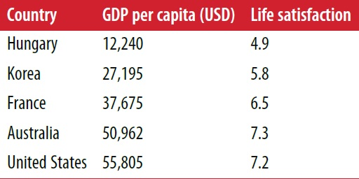
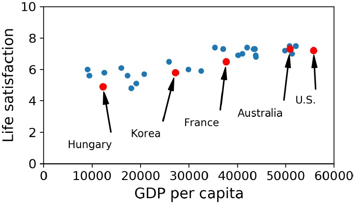
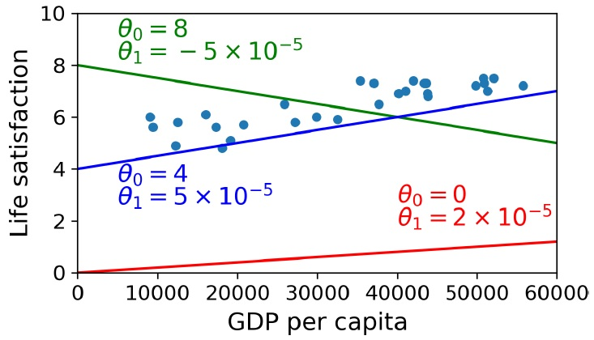
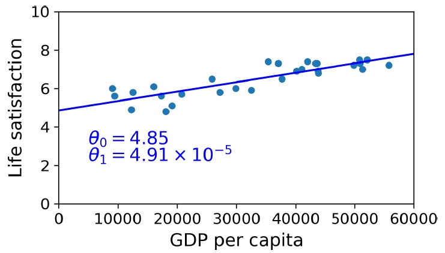
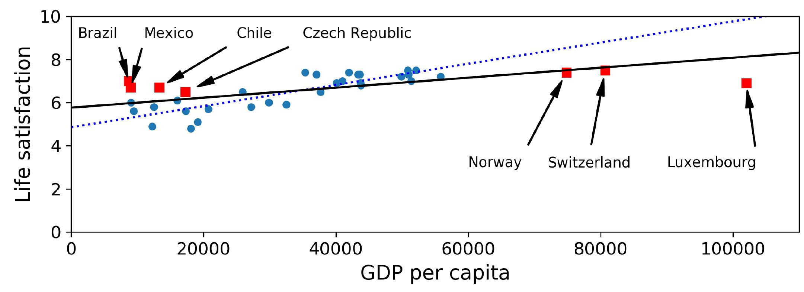

# هل يصنع المال السعادة؟

للإجابة على هذا السؤال سنقوم بجلب بيانات مؤشر الحياة الأفضل من [موقع](https://stats.oecd.org/index.aspx?DataSetCode=BLI) منظمة التعاون الاقتصادي والتنمية، وسنجلب ايضاً احصائيات حول نصيب الفرد من الناتج المحلي الإجمالي من [موقع](https://www.imf.org/en/Publications/SPROLLS/world-economic-outlook-databases) صندوق النقد الدولي. ثم سنقوم بجمع الجداول على بعضها ونرتب النتيجة حسب عمود نصيب الفرد من الناتج المحلي الإجمالي، ستجد في الجدول 1-1 جزءاً من الجدول الأخير.



هذا رسم بياني لمجموعة صغيرة وعشوائية من البلاد الشكل 1-17



دقق في الرسم البياني لتجد اتجاه خطياً عاماً للبيانات على الرغم من وجود بعض الضوضاء (أي ان البيانات عشوائية جزئياً بالنسبة لخط مستقيم) ويبدو أن الرضا عن الحياة يرتفع بشكل خطي إلى حد ما مع زيادة نصيب الفرد من الناتج المحلي الاجمالي في البلاد. لذلك قررنا أن ننمذج الرضا عن الحياة كدالة خطية مع نصيب الفرد من الناتج المحلي الاجمالي، تسمى هذه الخطوة اختيار النموذج، حيث قمنا باختيار نموذجاً خطياً للرضا عن الحياة بميزة واحدة فقط هي نصيب الفرد من الناتج المحلي الاجمالي، إنظر المعادلة 1-1

المعادلة 1-1 نموذج خطي بسيط
$جودة_الحياة = theta_0 + theta_1 * نصيب_الفرد_من_الناتج_المحلي_الاجمالي$

يحتوي هذا النموذج على معاملين (برامترين) $theta_0 theta_1$[^1]، ويمكننا نمذجة أي خط مستقيم من خلال تعديل هذين المعاملين، إنظر النموذج 1-18



نحتاج ان نحدد افضل قيم لمعاملي النموذج قبل استخدامه، لكن السؤال هو كيف يمكننا تحديد هذه القيم بأفضل طريقة ممكن، يأتي الجواب من تحديد مقياس الأداء. ولتحديد هذا المقياس نستطيع الإعتماد على **دالة المنفعة** والتي تقيس مدى جودة النموذج، أو الاعتماد على **دالة التكلفة** التي تقيم مدى سوء النموذج. يستخدم العلماء لمشاكل الانحدار الخطي عادة دالة التكلفة التي تقيس المسافة بين تنبؤات النموذج الخطي وأمثلة التدريب الحقيقة، عندها يكون الهدف هو تقليل هذه المسافات إلى الحد الأدنى.

يأتي دور خوارزمية الانحدار الخطي الآن، حيث نقوم بإعطائها أمثلة التدريب الحقيقة وتقوم هي بإيجاد النموذج الخطي الأنسب لتلك البيانات. هل لاحظت الفرق بين الخوارزمية والنموذج؟ فخوارزمية الانحدار الخطي هي مجموعة الخطوات التي نسلكها لإيجاد أفضل قيم (تدريب الآلة) لمعاملي الخط المستقيم $theta_0 theta_1$ بينما النموذج هو قيم هذه المعاملات التي وجدناها. وجدت الخوارزمية أن القيم الأنسب هي $theta_0=4.85 theta_1=4.91*10^-5$

إنظر الشكل 1-19 لترى كيف أن الخط المستقيم المرسوم يتناسب مع اتجاه البيانات العام، ويمثل هذا الاتجاه بشكل مقبول.



  نحن جاهزون الآن لتشغيل النموذج وتوليد التنبؤات، كمثال لنفترض أننا نريد معرفة درجة رضا القبراصة عن حياتهم، وأن بيانات منظمة التعاون الاقتصادي والتنمية لا تحتوي الإجابة.

نستطيع التنبؤ برضا القبارصة بجودة معقولة باستخدام نموذجنا الخطي: نبحث عن نصيب القبرصي من الناتج المحلي الاجمالي، فنجده 22,587 دولاراً، نعوض هذه القيمة في المعادلة الخطية لنجد رضا القبارصة عن حياتهم بحلها $4.85 + 22,587 × 4.91 × 10-5 = 5.96$

إنظر إلى الكود 1-1 لإشباع فضولك، فهو يقوم بتحميل البيانات، ويحضرها لتدريب النموذج[^2]، ثم يرسم شكلاً بيانياً للبيانات ليعطينا تصوراً عنها، ثم يدرب النموذج الخطي، ويتنبئ بالرضا عن الحياة بالنهاية[^3].

```python
import matplotlib.pyplot as plt
import numpy as np
import pandas as pd
import sklearn.linear_model

# Load the data
oecd_bli = pd.read_csv("oecd_bli_2015.csv", thousands=',')
gdp_per_capita = pd.read_csv("gdp_per_capita.csv",thousands=',',delimiter='\t', encoding='latin1', na_values="n/a")

# Prepare the data
country_stats = prepare_country_stats(oecd_bli, gdp_per_capita)
X = np.c_[country_stats["GDP per capita"]]
y = np.c_[country_stats["Life satisfaction"]]

# Visualize the data
country_stats.plot(kind='scatter', x="GDP per capita", y='Life satisfaction')
plt.show()

# Select a linear model
model = sklearn.linear_model.LinearRegression()

# Train the model
model.fit(X, y)

# Make a prediction for Cyprus
X_new = [[22587]] # Cyprus' GDP per capita
print(model.predict(X_new)) # outputs [[ 5.96242338]]
```
المثال 1-1 تدريب وتشغيل نموذج خطي باستخدم Scikit-Learn

إذا استخدمنا خوارزمية تعليم قائمة على المثال بدلاً من تلك القائمة على النموذج، فسنجد أن سلوفينيا لديها أقرب نصيب للفرد من الناتج المحلي الاجمالي لقبرص 20,732 دولاراً، وبما أن بيانات منظمة التعاون الاقتصادي والتنمية تخبرنا أن رضا السلوفينيين عن الحياة هو 5,7 فقد يكون تنبؤ رضا القبارصة عن حياتهم هو 5,7. إذا قمنا بالتصغير قليلاً لننظر إلى أقرب بلدين تاليين، فسنجد البرتغال واسبانيا مع قيم رضا عن الحياة 5,1 و 6,5 على التوالي، وعند حساب متوسط هذه القيم نحصل على 5,77 وهو قريب جداً من التوقعنا بناء على النموذج. تسمى هذه الخوارزمية البسيطة إنحدار الجيران الأقرب المعدودة في هذا المثال عددنا 3 جيران فقط أي k=3. لتجربة هذا النموذج قم باستبدال نموذج الانحدار الخطي بإنحدار الجيران الأقرب المعدودة في الكود السابق كما يلي

استبدل هذين السطرين
```python
import sklearn.linear_model
model = sklearn.linear_model.LinearRegression()
```
بهذين السطرين
```python
import sklearn.neighbors
model = sklearn.neighbors.KNeighborsRegressor(n_neighbors=3)
```
إذا سارت الأمور على مايرام فسيقوم النموذج بعمل تنبؤات جيدة، وإلا فقد نحتاج إلى استخدام المزيد من الميزات (مثل معدل التوظيف، الصحة، تلوث الهواء، إلخ) أو قد نحتاج إلى بيانات تدريب أكثر أو أجود، أو ربما نحتاج إلى نموذج أقوى على سبيل المثال نموذج انحدار متعدد الحدود.

ملخص ما عملنا عليه
* دراسنا بيانات التدريب
* حددنا النموذج المناسب
* دربنا النموذج على بيانات التدريب (حيث بحثت الخوارزمية عن قيم معاملات النموذج التي تجعل دالة الكلفة بأقل قيمة ممكنة)
* استخدمنا النموذج لعمل التنبؤات على الحالات الجديدة (هذا ما يسمى بالاستدلال) على أمل أن يتم تعميم النموذج بشكل جيد.

هذا مايبدو عليه مشروع تعلم الآلة النموذج باختصار، وسنتعلم عنه لاحقاً بالتفصيل عن تنفيذ مشروع كامل

قمنا بتغطية الكثير من الجوانب حتى الآن فنحن نعرف الآن ما يعنيه أن الآلة تتعلم حقيقة، ولماذ يكون مفيداً أن تتعلم الآلة، وما هي أنوع تعلم الآلة الأكثر شيوعاً، وكيف يبدو سير عمل المشروع تعلم الآلة النموذجي.
وسنتعلم لاحقاً عن التحديات التي قد نواجهها في تعليم الآلة والتي قد تمنعنا من اجراء تنبؤات دقيقة.


# تحديات تعليم الآلة الرئيسية
كما رأينا سابقاً وباختصار فإن مهمتنا هي تحديد خوارزمية التعلم وتدريبها على بيانات التدريب، لذا فإن الشيئين اللذين يمكن أن تأتي منهم الأخطاء هما خوارزمية سيئة أو بيانات سيئة، وسنبدأ بأمثلة عن البيانات السيئة.

## 1. كمية بيانات التدريب غير كافية
يتعلم الطفل تميز التفاحة بمجرد الإشارة إلى إحداها وترديد كلمة "تفاحة" عدة مرات، ثم يصبح الطفل قادر على التعرف على جميع أنواع التفاح بألوانه وأشكاله المختلفة، هذا هو الذكاء البشري. لكن تعلم الآلة لم يصل إلى هذا الحد بعد، وتتطلب معظم خوارزميات تعليم الآلة الكثير من البيانات لتعمل بشكل صحيح، حتى بالنسبة للمشكلات البسيطة جداً، فنحن بحاجة إلى آلاف الأمثلة عادة، أما بالنسبة إلى المشكلات الأكثر تعقيداً مثل التعرف على الصور أو الكلام، فقد نحتاج إلى ملايين الأمثلة، (إلا إذا كان بالإمكان إعادة استخدام أجزاء من نموذج مدرب مسبقاً).

### فعالية البيانات غير المفهومة
بيّن الباحثين من مايكروسوفت مايكل بانكو وإريك بريل في [بحث](https://dl.acm.org/doi/10.3115/1073012.1073017) مشهور نشر عام 2001 أن مجموعة من خوارزميات تعليم الآلة المختلفة تتضمن خوارزميات بسيطة إلى حد ما تعمل جيداً على مشكلة معقدة تتعلق بإلغاء غموض[^4] اللغة الطبيعية بمجرد إعطائها كمية كافية من بيانات، إنظر الشكل-1-20

![الشكل 1-20 أهمية البيانات مقابل الخوارزميات[^5]](assets/figure-1-20.jpg)

يقول المؤلفان أن نتائجهما تشير إلى أنه يجب اعادة النظر وانفاق الوقت والمال على جمع البيانات بدلاً من تطوير الخوارزميات.

أشارت ورقة بحثية كتبها بيتر نورفيغ عام 2009 بعنوان ["فعالية البيانات غير المفهومة"](https://static.googleusercontent.com/media/research.google.com/en//pubs/archive/35179.pdf) أن البيانات مهمة أكثر من الخوارزميات للمشكلات المعقدة، ومن الجدير بالذكر أن مجموعات البيانات الصغيرة والمتوسطة الحجم لا تزال شائعة الاستخدام وليس من السهل أو الرخيص الحصول على بيانات تدريب اضافية، لذلك لم نتخلى عن تطوير الخوارزميات حتى الآن.

## 2. بيانات التدريب التي لا تمثل المشكلة
يجب أن تمثل بيانات التدريب كافة حالات المشكلة الحالية والجديدة، من اجل التعميم بشكل جيد. أي بناء نموذج يعمم ما تعلمه على كافة الحالات المستقبلية، وينطبق هذا الشرط على نوعي الخوارزميات القائمة على النموذج أو تلك القائمة على المثال.

سأفشي لك سراً، هو أن مجموعة البلاد التي دربنا نموذجنا الخطي عليها سابقاً لم تكن تمثل المشكلة تماماً، فقد تم اخفاء عدد قليل من البلدان، إنظر الشكل-1-21 لترى كيف تبدو البيانات عند اضافة البلدان التي اخفيت.



سنحصل على الخط المتصل عند تدريب نموذج خطي على هذه عينة البيانات الشاملة هذه، ويمثل الخط المنقط نموذجنا القديم. لاحظ كيف أن اضافة عدد قليل من البلدان المخفية سابقاً لا يؤدي فقط غلى تغيير النوذج جذرياً، لكنه يوضح أن مثل هذا النموذج الخطي البسيط ربما لا يعمل بشكل جيد على الاطلاق. حيث يبين أن الدول الغنية جداً ليس أكثر سعادة من الدول متوسطة الغنى (تبدو أكثر تعاسة في الواقع)، وعلى العكس من ذلك تبدو بعض الدور الفقيرة أكثر سعادة من العديد من الدور الغنية.

يبدو واضحاً أنه بالاعتماد على مجموعة بيانات لا تمثل المشكلة بشكل شامل قمنا بتدريب نموذج لن يقدم تنبؤات دقيقة، خاصة عن البلدان شديدة الفقر أو شديدة الغنى.

استخدام مجموعة تدريب تمثل كافة الحالات التي نريد التعميم عليها وتشملها من أهم اسباب النجاح، لكن غالباً ما تكون هذه الخطوة أصعب مما تبدو، فإذا كانت العينة صغيرة جداً فسنحصل على ضجيج أثناء أخذ العينات، لكن حتى إن كانت العينات كبيرة جداً فيمكن أن تكون غير شاملة إذا استخدمت طريقة خاطئة لأخذ العينات، وهذا ما يسمى التحيز في أخذ العينات.

### مثال مشهور على تحيز أخذ العينات
حدث في انتخابات الرئاسة الأمريكية عام 1936 احد اشهر أمثلة تحيز أخذ العينات، والذي حرض لاندون ضد روزفلت، حيث أجرت مجلة Literary Digest استطلاعاً كبيراً للغاية، وأرسلت بريداً إلى حوالي 10 ملاين شخص، وحصلت على اجابة من 2.4 مليون شخص، وتوقعت بثقة عالية أن لاندون سيحصل على 57% من الأصوات. لكن روزفلت فاز بنسبة 62% من الأصوات. وقد كان الخلل في طريقة أخذ العينات:

* أولاً، استخدمت المجلة أدلة الهاتف وقوائم المشتركين في المجلات وقوائم عضويات النوادي وما شابه ذلك، للحصول على العناوين لإرسال الإقتراع لهم. وكما هو واضح فإن هذه الفئات تميل إلى تفضيل الأغنياء، الذين من المرجح أن يصوتوا للجمهوريين أي لاندون

* ثانياً، أجاب أقل من 25% من الاشخاص الذي تلقوا الاستطلاع عليه، وهذا تحيزاً آخر في أخذ العينات، حيث استبعد الأشخاص الذين لا يهتمون بالسياسة كثيراً، والأشخاص الذي لا يحبون المجلة، ومجموعات رئيسية أخرى، وهذا نوع خاص من تحيز اخذ العينات يسمى *تحيز عدم الاستجابة*


[^1]: يستخدم غالباً الحرف الاغريقي $theta$ لتمثيل معاملات النموذج اصطلاحاً.
[^2]: لا يحتوي هذا الكود على الدالة `prepare_country_stats()` ستجد في الملحقات كود Pandas ممل يجمع بيانات رضا الحياة ونصيب الفرد من الناتج المحلي الاجمالي
[^3]: هون على نفسك إذا لم تفهم الكود كاملاً، سنتعلم عن Scikit-Learn أكثر فيما بعد
[^4]: على سبيل المثال معرفة ما إذا كان يجب كتابة to أو two أو too بناء على السياق.
[^5]: نسخت الشكل بإذن من بانكو وبريل 2001، منحنيات التعلم لمجموعة لتوضيح الإرتباك