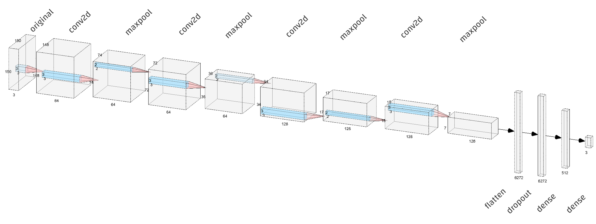

# نموذج التعرف على الصور
احدثت خوارزميات التعرف على محتوى الصور وتصنيفها ثورة في عالم الذكاء الاصطناعي، حيث فتحت المجال واسعاً أمام تطبيقات التعلم العميق الذي كان المكون الأساسي في هذه الخوارزميات، في هذا المقال سنتعلم كيفية بناء نموذج **تعلم عميق** يستطيع تصنيف مجموعة الصور إلى ثلاث أصناف لتوضيح الفكرة وطريقة العمل.

سنعمل على مجموعة بيانات حجرة-ورقة-مقص المجمعة من قبل @lmoroney لغرض تجريب امكانية الرؤية الحاسوبية والتعرف على محتوى الصور وتصنيفها، تستطيع إيجاد النسخة الأصلية من مجموعة البيانات هذه في [الرابط التالي](https://www.tensorflow.org/datasets/catalog/rock_paper_scissors).

## الخطوة 1 - تحميل البيانات ومعالجتها المسبقة
سنقوم بتحميل كلا من بيانات التدريب `training` والاختبار `testing` من مجلدات نظام التشغيل حيث يحتوي كلاً منهما على ثلاث مجلدات كل واحد لصنف محدد من العينات الأول لعينات الأيادي عندما تكون على شكل حجرة `rock`، والثاني لعينات الأيادي عندما تكون على شكل ورقة `paper`، والثالث يحوي عينات الأيادي عندما تكون على شكل مقص `scissor`. يعمل الصنف [`ImageDataGenerator`](https://www.tensorflow.org/api_docs/python/tf/keras/preprocessing/image/ImageDataGenerator) على تدفق العينات من المجلدات ضمن دفعات ويطبق على هذه العينات مجموعة من التحويلات مثل التكبير والتصغير والدوران وذلك بغرض زيادة حجم عينات التدريب واستخراج منها أكبر قدر ممكن من المميزات. نقوم أيضاً بتحجيم كافة العينات إلى 150x150 بكسل `target_size=(150,150)` ثم استخراج أسماء الأصناف من المجلدات نفسها `class_mode='categorical'`

## الخطوة 2 - بناء نموذج التعلم العميق
سيتألف نموذج التعرف على الصور من 4 طبقات ترشيحية تعمل بعدها طبقة التسطيح على تحويل المصفوفة إلى متجه لتأتي بعدها 3 طبقات أخرى تعمل على تصنيف هذا المتجه، لاحظ التشابه الكبير بين الشكل التالي والمصفاة كيف أن الصورة تدخل على شكل 150x150x3 لتبدأ عمليات الترشيح وذلك بمرورها على الطبقات ال 12 حتى نحصل في نهاية المصفاة على واحد من ثلاث اصناف.

1. طبقات الترشيح الأربعة Convolution: تتكون طبقة الترشيح من طبقتين `conv` و `maxpool` 
    - تعمل الطبقة الأولى على استخراج المميزات الأهم من الصورة بعد تقطيعها على أجزاء 3x3، ما يضخم تفاصيل الصورة بشكل مناسب (إنظر كيف تحولت الصورة من 150x150x3 إلى 148x148x64)
    - تعمل الطبقة الثانية على استخراج المميزات الأهم من هذا الحجم الكبير من المميزات التي تم استخراجها في الطبقة السابقة (إنظر كيف تحولت من 148x148x64 إلى 74x74x64)
    - نقوم بتكرار هذه البنية أربع مرات، في كل مرة نضخم الصورة ونستخرج أهم مميزاتها عن غيرها، حتى نصل إلى 7x7x128
2. طبقة التاسعة `Flatten` تعمل على تحويل المصفوفة الأخيرة 7x7x128 إلى متجه بطول 6272 وذلك ليسهل التعامل معه، فهذه الطبقة ستعطينا متجه يمثل كل صورة من مجموعة العينات لكن بدلاً من أيكون التمثيل مرئياً كما في 150x150x3 سيكون التمثيل حسابياً 6272x1x1
4. الطبقة العاشرة `Dropout` تعمل على استبعاد بعض قيم المتجه 6272x1x1 عشوائياً والذي ثبت تجريبياً أنه يعمل على تحسين جودة التصنيف
5. الطبقة الحادية عشر `Dense` تعمل على نمذجة العلاقة بين المتجه 6272x1x1 والأصناف الثلاثة التي نحتاج أن نتنبئ بها
6. الطبقة الثانية عشر `Dense` تقدم خرج النموذج كتنبؤ بإحتمال موزع على 3 خلايا، وبما أن مجموع قيم الاحتمال يساوي الواحد فإن الخلية ذات الاحتمال الأكبر هي صنف الصورة

وسنستخدم categorical_crossentropy كدالة خسارة لأنها تمكن النموذج من توليد العديد من القيمة على الخرج وفي حالتنا سيكون الخرج مؤلفاً من 3 قيم هي الأصناف (حجرة-ورقة-مقص) وسيكون مجموع القيم الثلاثة يساوي الواحد وبالتالي سيكون الخرج ذو القيمة الكبرى هو الصنف المقصود. وستعمل دالة `rmsprop` على تحسين أداء النموذج مع كل دورة تدريب من ال 25 دورة كما سنجد في الخطوة رقم 3. وسيتم استخدام الدقة accuracy كمقياس أداء نقيس بها تحسن أداء النموذج في دورات التعليم ال 25 حيث كلما اقتربت الدقة من 1 يكون النموذج قد تحسن بشكل اكبر.

## الخطوة 3 - تدريب النموذج والتحقق من صحته
سنقوم بتدريب النموذج على 25 حقبة تعليمة نعمل بكل منها على تحسين أداء النموذج بإستخدام عينات التدريب ثم نتحقق من دقته باستخدام عينات الاختبار، في هذه الخطوة نجني ثمار كل العمل السابق لذلك هي من أقصر الخطوات وأكثرهم استهلاكاً لوقت التنفيذ.

## الخطوة 4 - رسم الدقة والخسارة مقابل حقب التدريب
سنقوم برسم كلاً من دقة النموذج على عينات التدريب ودقته على عينات الاختبار مقابل حقب التدريب ال 25، يعتبر الرسم البياني هذا أهم الأدوات لأنه يوضح كيفية تحسن دقة النموذج في كل حقبة تعليمية ويكون خط البيان val_accuracy المرتبط بعينات الاختبار هو الأهم لأنه الأقرب لدقة النموذج على البيئة الإنتاجية. ثم سنقوم برسم خسارة النموذج مع كل حقبة تعليمية طبعاً يجب أن تقل الخسارة مع كل حقبة. إذا كان النموذج يتحسن ويتعلم بإستمرار سيكون الأداء الأفضل عندما تصل الخسارة إلى الصفر وذلك أقرب ما يكون إلى المستحيل.

## الخطوة 5 - اختبار وتجريب النموذج
هنا سنجني ثمار كل العمل في الخطوات الثمانية السابقة وسنقوم بتجريب النموذج بأنفسنا نعطيه احدى صور العينات موجودة كانت أم جديدة في عينات التدريب والاختبار لنتوقع منه أن يعطينا احتمال ان تكون اليد تنتمي إلى واحدة من الأصناف الثالثة حجرة - ورقة - مقص.

ارجو أن تقوم بنسخ الكود والبيانات إلى جهازك وتجريبها 

أي ملاحظة ستكون موضع ترحيب كبير
شكراً للقراءة

