

  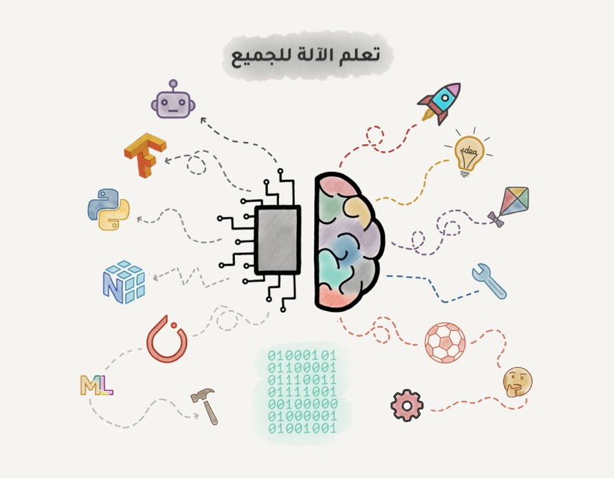

بلغة بسيطة، وأمثلة حقيقة

تعلم الآلة مثل الأساطير الكل يتحدث عنها، وقلة من قرأ عنها في الكتب، ولا أحد يعرف ما حصل حقاً سوى من عاصرها. إذا حاولت يوماً قراءة مقالة عن تعلم الآلة على الإنترنت فعلى الأغلب ستجد نوعين من هذه المقالات: أوراق البحوث الأكاديمية المليئة بالنظريات والرموز الرياضية أو حكايات مريبة حول الذكاء الاصطناعي، وسحر البيانات ووظائف المستقبل.

لذا قررت أن اكتب مقالة طلما تمنيت لو كانت موجودة. مقدمة بسيطة للذين أرداوا فهم تعلم الآلة والمشاكل التي تقوم على حلها، والحلول العملية التي تقدمها، بلغة بسيطة بعيداً عن النظريات عالية المستوى، ولجميع المهتمين سواءً كانوا مبرمجين أو مديرين أو رواد أعمال.

## لماذا نريد للآلات أن تتعلم؟
هذا محمد، يخطط لشراء سيارة، لذا قام بالبحث عبر عدة مواقع على الإنترنت وعرف أن سعر السيارة الجديدة بحدود 75 ألف ريال، وأن السيارة المستخدمة لمدة سنة بحدود 71 ألف ريال، وأن السيارة المستخدمة لمدة سنتين بحدود 68 ألف ريال، وهكذا ينقص من سعر السيارة 4 آلاف ريال تقريباً كلما زاد عمرها سنة.
يبدأ محمد - المحلل اللامع - باستنباط نمط واضح يربط سعر السيارة بعمرها، حيث تخسر السيارة 4 آلاف ريال مع كل سنة، لكن هذا السعر لن يقل على 40 ألف ريال.

  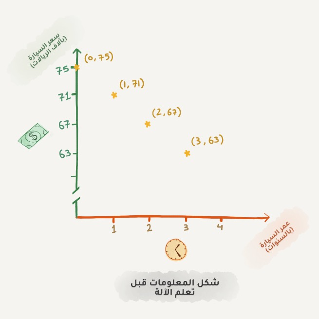

يدعى هذا النوع من الاستنباط بمصطلحات تعلم الآلة (النوع الذي نتنبأ فيه بقيمةٍ ما بناءً على بيانات تاريخية معروفة) بالانحدار. ويفعل الناس ذلك دائماً عندما يحاولون تقدير قيمة غرض مستعمل، أو حتى عند تقدير كميّة اللحم اللازمة لحفل شواء، 200 جرام للشخص؟ وسيحضر 10 أشخاص.
عموماً، يبدو أنه من الجيد أن يكون لدينا صيغة بسيطة لكل مشكلة في العالم، ولا سيما حفلات الشواء 🤣، لكن لسوء الحظ هذا مستحيل.

  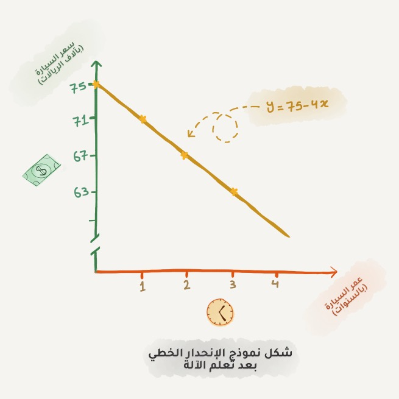

لتوضيح السبب دعنا نعود إلى مثال السيارات. تكمن المشكلة أن لدينا الكثير من العوامل التي تلعب دوراً بتحديد سعر السيارة. إضافة إلى عمر السيارة لدينا عشرات المواصفات الموجودة فيها والحالة الفنية لها، وحتى طلب السوق عليها والكثير من العوامل الخفية، ومن الصعب جداً الاحتفاظ بكل هذه البيانات برأس محمد في أثناء حسابه لسعر السيارة. حتى أنا صعب علي 😜

يميل الناس إلى التراخي والكسل، وهذا ما دفع الإنسان دائماً للبحث عن الآلة لتقوم بالحسابات عنه. لذا دعنا نسلك الطريق الرياضي ونعطي الآلة بعض البيانات ونطلب منها العثور على جميع الأنماط المخفية التي تلعب دوراً بتحديد السعر.
تتعامل الآلة مع هذا النوع من المهمات بشكل أفضل مما يفعله الشخص العادي عندما يقوم بتحليل كافة العلاقات التي تربط أسعار السيارات بمواصفاتها في ذهنه.
وهذا بالضبط سبب ولادة تعلم الآلة.

## المكونات الثلاثة لتعلم الآلة
في البداية علينا أن نستبعد كل الخرافات حول الذكاء الاصطناعي، فالهدف الوحيد من تعلم الآلة هو توقع نتائج البيانات الجديدة بناءً على البيانات المدخلة سابقاً.فقط!. بوصف آخر (التعلم من التجارِب السابقة). لذا نستطيع تمثيل جميع المشاكل التي يمكن حلها بتعلم الآلة بهذه الطريقة، فإذا لم نستطع تمثيل المشكلة على أنها علاقة بين بيانات مدخلة ونتائج متوقعة فإن المشكلة لا يمكن حلها بالذكاء الاصطناعي من الأساس.

وهكذا يبدو من المنطقي أنه كلما زاد تنوع عينات البيانات لديك، كان من الأسهل العثور على الأنماط ذات الصلة والتنبؤ بنتائج أدق وأوسع. وبهذا سنوضح المكونات الثلاث لتعلم الآلة:

  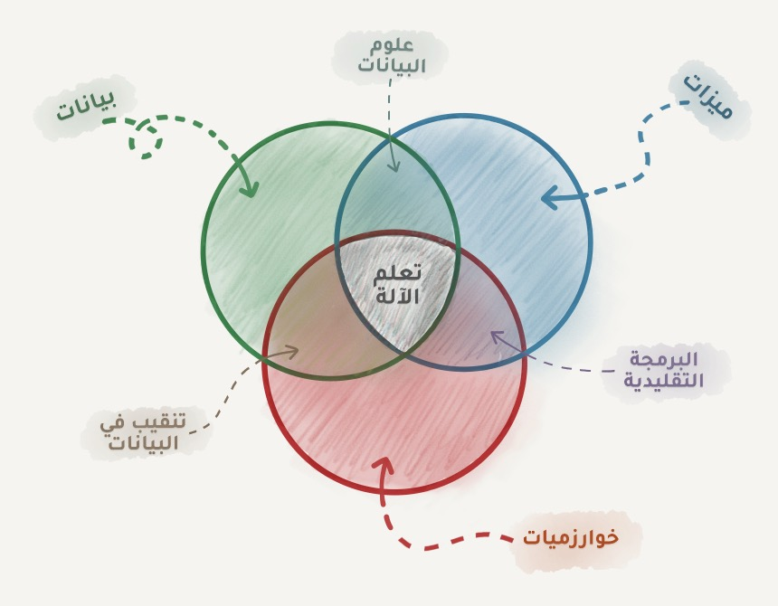

**البيانات**: إذا أردت كشف رسائل التصيد الإلكترونية، فاجمع عينات من تلك الرسائل. وإذا أردت التنبؤ بأسعار الأسهم في المستقبل، فابحث عن سجلات الأسعار السابقة. وإذا أردت معرفة تفضيلات المستخدمين، فقم بتحليل أنشطتهم على وسائل التواصل الاجتماعي. وكلما كانت البيانات أكثر تنوعاً كانت النتيجة أفضل. يختلف الحد الأدنى لهذه العينات بناءً على صعوبة المشكلة وقدرة البيانات المستعلمة على تمثيل تلك المشكلة.

هناك طريقتان رئيستان للحصول على البيانات وتعريفها: يدوياً وآلياً. تحتوي البيانات التي يتم جمعها وتعريفها يدوياً على أخطاء أقل بكثير لكنها تستغرق وقتاً أطول في التجميع ما يجعلها عموماً أكثر تكلفة. وتعتبر الطريقة الآلية أرخص فأنت تجمع كل ما يمكنك الحصول عليه وتأمل أن يكون جيداً

تستخدم بعض الشركات مثل (Google) عملاءها لتصنيف البيانات لهم مجاناً. هل تتذكر (ReCaptcha) التي تجبرك على "تحديد جميع لافتات الشوارع"؟ هذا بالضبط ما يفعلونه (يجعلونك تعمل لديهم بشكل مجاني). ولو كنت مكانهم كنت سأجعل (Captcha) تظهر أكثر بكثير.

تعتبر البيانات أهم مكونات تعلم الآلة، حيث أنه من الصعب للغاية الحصول على مجموعة جيدة من البيانات، لذا قد ترى بعض الشركات تكشف عن خوارزمياتها، لكن نادراً ما تكشف تلك الشركات عن مجموعات البيانات التي لديها.

**الميزات** (Features): تسمى أيضاً بالمعاملات (Parameters) أو المتغيرات (Variables). هي العوامل التي تنظر إليها الآلة لكي تتعلم، وبمثال السيارات يمكن أن تكون هذه الميزات هي المسافة المقطوعة بالسيارة أو عدد مرات دخولها للصيانة أو عدد الحوادث التي حصلت لها أو حتى جنس المستخدم في حالة أردنا دراسة تفضيلات المستخدمين، أما بالنسبة لمثال تنبؤ أسعار الأسهم فتاريخ سعر السهم سيكون مرشحاً ممتازاً ليكون ضمن الميزات، كذالك عدد تكرار الكلمات في نص الرسالة بالنسبة لرسائل التصيد.

تبدو عملية استخراج الميزات سهلة عندما تكون البيانات ضمن جداول، فالميزات هي أسماء الأعمدة. لكن ماذا ستكون تلك الميزات لو كان لدينا 100 جيجابايت من الصور التي تحتوي على قطط؟ لا يمكننا اعتبار كل بكسل كميزة. هذا هو السبب في أن اختيار الميزات الصحيحة يستغرق عادة وقتا أطول من أي جزء آخر في تعلم الآلة، وهذا هو أيضاً المصدر الرئيس للأخطاء فنحن البشر نميل للشخصنة ونختار الميزات التي نحبها أو التي نراها أكثر أهمية من وجهة نظرنا، لذا من فضلك تجنب أن تكون "بشراً" عند اختيار الميزات.

**الخوارزميات** المكون الأكثر وضوحاً. يمكن حل أي مشكلة بطرق مختلفة، لكن الطريقة المختارة ستؤثر على دقّة النموذج النهائي، وأدائه، وحجمه. هنا ملمح بسيط ومهم: فإذا كانت البيانات المدخلة سيئة، فلن تساعد حتى أفضل الخوارزميات في الحصول على الدقّة المطلوبة. يشار إلى هذه النقطة أحياناً باسم "garbage in – garbage out" لذا لا تولي الكثير من الاهتمام لنسبة الدقّة، بل حاول الحصول على مزيد من البيانات الجيدة أولاً.

## التعلم والذكاء

[// Suggestion]: # (الجملة غير واضحة وتحتاج إلى اعادة صياغة)
قرأت مرة مقالاً على شبكة أخبار بعنوان: "هل ستحل الشبكات العصبية محل تعلم الآلة؟" يسمي الإعلاميون أي انحدار خطي سيء ذكاءً اصطناعياً على أقل تقدير، يوضح الشكل التالي تلك الفُرُوق بين الذكاء الاصطناعي، وتعلم الآلة والشبكات العصبية:

  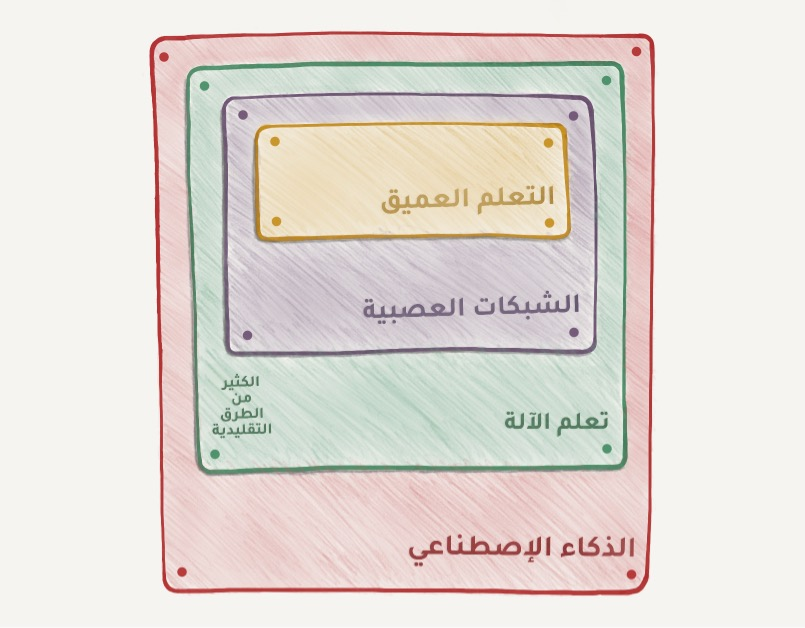

**الذكاء الاصطناعي (Artificial Intelligence)**: اسم كامل المجال المعرفي كأي مجال آخر مثل علم الأحياء والكيمياء.

**تعلم الآلة (Machine Learning)**: الجزء المهم من علم الذكاء الاصطناعي، لكنه ليس الجزء الوحيد.

**الشبكات العصبية (Neural Networks)**: أحد أشهر أنواع تعلم الآلة ولكن يوجد هناك خيارات جيدة أخرى.

**التعلم العميق (Deep Learning)**: الطريقة الجديدة لبناء وتدريب واستخدام الشبكات العصبية، في الأساس كانت بنية جديدة لهذه الشبكات ولا أحد يقوم بالفصل بين التعلم العميق والشبكات العصبية في أيامنا هذه، حتى أننا نستخدم نفس المكتبات لهم. لذلك من الأفضل أن تستخدم اسم نوع الشبكة فقط وتجنب الكلمات الرنانة.

فالقاعدة العامة هي مقارنة الأشياء التي من نفس المستوى، وهذا هو السبب في أن عبارة مثل "هل ستحل الشبكات العصبية محل تعلم الآلة" تبدو مثل "هل ستحل العجلات محل السيارات؟" لذلك، عزيزي الإعلامي هذه الجمل الرنانة تضر بسمعتك كثيراً.

| تستطيع الآلة | لا تستطيع الآلة |
|:---:|:---:|
| التنبؤ | ابتكار شيء جديد |
| الاستذكار | التعلم بسرعة كبيرة | 
| إعادة الإنتاج | تجاوز مهمتها |
| اختيار الصنف الأفضل | الحلول محل البشر |

## خريطة عالم تعلم الآلة
إذا كانت القراءة الطويلة متعبة لك، فقم بإلقاء نظرة على الشكل التالي للحصول على نظرة عامة.

[// Question]: # (ما الشكل الذي تفكر بوضع هنا؟)

تذكر دائماً أنه لا توجد طريقة واحدة للحل في عالم تعلم الآلة. سترى دائماً العديد من الخوارزميات المناسبة، وعليك اختيار أيها تناسب مشكلتك أكثر. يمكن استخدام الشبكات العصبية لحل كل المشاكل عملياً، لكن من سيدفع ثمن بطاقة الشاشة (GeForce) ليتم التدريب عليها؟

لنبدأ بنظرة عامة على الأساسيات، ففي الوقت الحاضر هناك أربع أنواع رئيسية لتعلم الآلة، كما يلي:

## الجزء 1. تعلم الآلة الكلاسيكي
[// Suggestion]: # (الجملة "الإحصاء البحت" تبدو غير واضحة)
جاءت أساليب تعلم الآلة الأولى من علم الإحصاء البحت في خمسينيات القرن الماضي. قامت هذه الأساليب بحل المهام الرياضية الأساسية مثل البحث عن العلاقات بين الأرقام، وتقييم قرب نِقاط البيانات من بعضها، وحساب الاتجاهات.

يعمل نصف الإنترنت على هذه الأساليب في وقتنا الحاضر. فعندما ترى قسم "يمكنك القراءة أيضا" أسفل المقالة التي تقرأها أو يقوم المصرف الذي تتعامل معه بحظر بطاقتك الائتمانية في محطة وقود على خط الرياض - الدمام، فمن المحتمل أن يكون هذا من عمل إحدى هذه الأساليب الصغيرة 😍.

تعد الشركات التقنية الكبرى من أشد المعجبين بالشبكات العصبية لأنه من الواضح لهم أن زيادة دقّة التنبؤ بنسبة 2% قد يؤدي إلى عائدات إضافية بقيمة 2 مليار على سبيل المثال. لكن عندما تكون في شركة صغيرة فإن هذا غير منطقي. سمعت مرةً بقصة عن فريق مختص في تعلم الآلة أمضى عاماً كاملاً يعمل على خوارزمية توصية جديدة للأصناف على موقع التجارة الإلكتروني الخاص بهم، قبل أن يكتشفوا أن 99% من الزيارات جاءت من محركات البحث، ما جعل خوارزميتهم عديمة الفائدة لأن معظم المستخدمين لم يفتحوا الصفحة الرئيسة أساساً.

تعد الأساليب التقليدية واضحة جداً، وذات شعبية كبيرة حيث يمكن شرحها بسهولة، إنها مثل العمليات الحسابية الأساسية، نستخدمها يومياً دون أن نفكر بها.

ينقسم تعلم الآلة الكلاسيكي غالباً إلى قسمين: التعليم بمعلم (Supervised Learning)، والتعليم بدون معلم (Unsupervised Learning)

### 1.1 التعلم بمعلم
يكون للآلة في القسم الأول مشرف أو أستاذ -معلم- يعطيها جميع الإجابات، مثل أن يعطي الآلة صورة ويخبرها بما تحتويه. يقوم المعلم بتقسيم كل الصور بناء على محتوياتها ثم يقوم بتمريرها للنموذج مع اسم (Label) ما تحتويه مثل قطة، فيل، حصان إلخ. تستخدم الآلة هذه الأمثلة للتعلم واحدا تلو الآخر.

التعليم دون معلم يعني أن الآلة تترك بمفردها مع كومة من صور الحيوانات مهمتها هي تجميع الصور بناء على نوع الحيوان الذي فيها، لا يوجد معلم ولا يوجد اسم على كل صورة باسم الحيوان الذي بداخلها. تحاول الآلة العثور على الأنماط بمفردها، سنتحدث عن هذه الأساليب فيما بعد.

ستتعلم الآلة بشكل أسرع مع معلم، لذلك يعتبر هذا الأسلوب اكثر شيوعاً في مهام الحياة اليومية، ويوجد منه نوعان.
**التصنيف**: التنبؤ بصنف الكائن من ضمن مجموع من الأصناف المحددة مسبقاً، و**الانحدار**: التنبؤ بقيمة معينة من على محور الأعداد.

### التصنيف Classification

  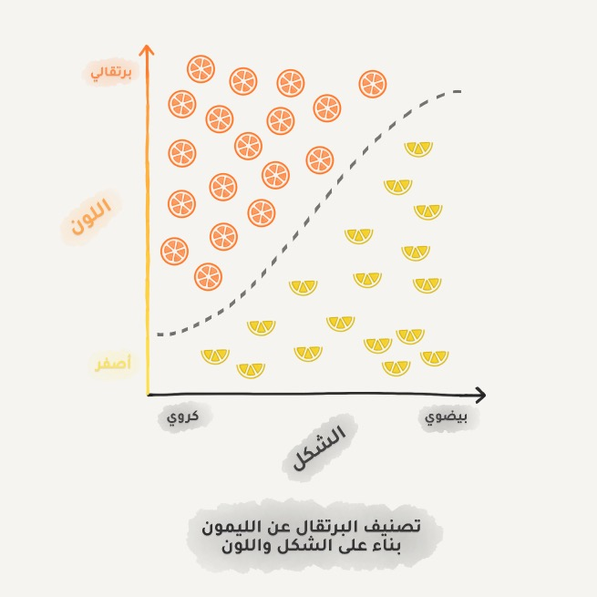

"هو تقسيم الكائنات بناء على إحدى ميزاتها المعرفة مسبقاً. كفصل حبات البرتقال عن حبات الليمون أو فصل أوراق اللعب حسب لونها، والمستندات حسب اللغة المكتوبة بها، والموسيقى حسب نوعها"

يستخدم اليوم من أجل:
> تصفية رسائل التصيد في البريد الإلكتروني، وكشف لغة نص ما، و- البحث عن الوثائق المتشابهة، وتحليل المشاعر، والتعرف على الحروف والأرقام المكتوبة بخط اليد، وكشف التزوير في الوثائق الرسمية

الخوارزميات الشائعة في التصنيف: 
> Naive Bayes, Decision Tree, Logistic Regression, K-Nearest Neighbours, Support Vector Machine, Neural Networks

يدور تعلم الآلة حول تصنيف الأشياء في الغالب، تعمل الآلة هنا مثل الطفل الذي يتعلم ترتيب ألعابه: هنا سيارات السباق، وجانبها سيارات الشحن، ثم الرجل الحديدي، والرجل الآلي، ثم لا لا هذا خطأ يجب أن يكون رجل العنكبوت بجانب الرجل الحديدي.

تحتاج الآلة في التصنيف إلى معلم يقوم بتسمية البيانات حتى تتمكن الآلة من فرز البيانات الجديدة بناء على التسميات السابقة. يمكن تصنيف كل شيء، فيمكن تصنيف المستخدمين بناء على اهتماماتهم كما يفعل تويتر وفيسبوك في صفحتك الرئيسية، ويمكن تصنيف المقالات بناء على اللغة والموضوع كما تفعل محركات البحث، ويمكن تصنيف الموسيقى بناء على النوع كما في قوائم تشغيل YouTube و Spotify، حتى رسائلك الإلكترونية يصنف الغير صالح منها في مجلد منفصل.

تستخدم خوارزمية [Naive Bayes](https://www.youtube.com/watch?v=O2L2Uv9pdDA) في تصفية وإبعاد رسائل التصيد الإلكتروني على نطاق واسع. تقوم هذه الخوارزمية بعد المرات التي ذكرت فيها كلمة "ورقة يانصيب" في الرسائل الغير مرغوب فيها وفي الرسائل العادية، ثم توجد جداء الاحتمالات باستخدام معادلة بايز، وتجمع النتائج لنحصل بهذا على آلة تعلمت فرز الرسائل الغير مرغوب بها عن الرسائل العادية.

  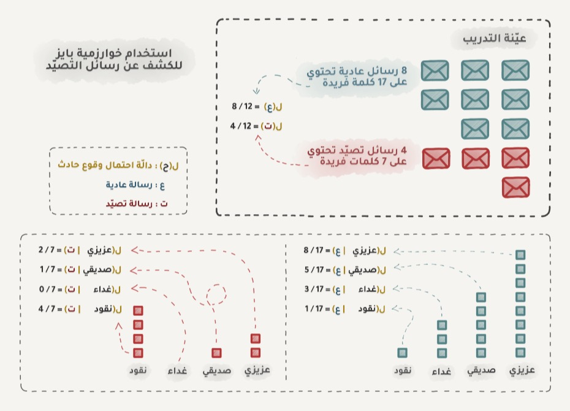

  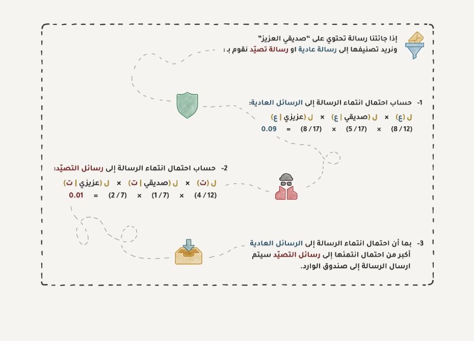

تعلم لاحقاً مرسلو رسائل التصيد كيفية التعامل مع عوامل تصفية الرسائل Bayesian وذلك بإضافة الكثير من الكلمات الجيدة في نهاية البريد الإلكتروني، وللسخرية سميت هذه الطريق بتسميم بايز (Baysesian Poisoning). سجلت خوارزمية بايز نفسها بالتاريخ باعتبارها أول خوارزمية عملية وأنيقة لمدة طويلة، لكن تستخدم خوارزميات أخرى في وقتنا الحاضر.

لنأخذ مثالاً عملياً آخر على التصنيف، في حال احتجت إلى قرض من أحد البنوك فالسؤال كيف سيعرف البنك ما إذا كنت ستدفع أقساطك أم لا؟ البنك لا يملك طريقة لمعرفة هذا على وجه اليقين، لكن البنك لديه الكثير من المعلومات حول الزبائن الذين اقترضوا مال من قبل مثل أعمارهم، تعليمهم، الوظائف التي يشغلونها، ورواتبهم، والأهم من ذلك التزامهم بسداد تلك الأقساط أم لا.

يستطيع البنك استخدام هذه البيانات لتعليم الآلة الأنماط التي تربط معلومات الأشخاص بإلتزامهم بالدفع فالمشكلة بالنسبة للبنك ليست في الحصول على إجابة. المشكلة أن البنك لايستطيع الوثوق بالآلة بشكل أعمى، ماذا لو حدث مشكلة في النظام، أو أن هناك خرق أمنياً فيه. يحتاج النبك إلى مايدعم قراره بإصدار القرض من عدمه.

  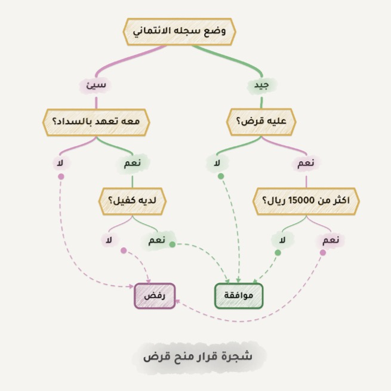

تتعامل أشجار القرار [Decision Trees](https://www.youtube.com/watch?v=_L39rN6gz7Y) مع هذا النوع من المشاكل، فتقوم بتقسيم جميع بيانات الأشخاص تلقائياً إلى أسئلة نعم \ لا. قد تبدو بعض الأسئلة التي تطرحها شجرة القرار غريبة من منظورنا كبشر، على سبيل المثال قد يتم تقسيم البيانات فيما إذا كان دخل المقترض أكبر من 3543 ريال، رغم غرابة الرقم تأتي شجرة القرار بمثل هذه الأسئلة لتقسيم البيانات بشكل أفضل في كل خطوة تقسيم.

كلما كان السؤال قريبا من جذر الشجر اتسع نطاقه، وتضيق هذه الأسئلة كلما اقتربت من أورقها وهكذا تتكون شجرة القرار، يمكن لأي محلل أن يأخذ هذه الأسئلة ويشرح نتيجتها بسهولة فيما إذا كانت بإعطاء القرض للزبون أم لا.

يبدو واضحاً أنه بسبب إمكانية تفسير قرارات هذه الأشجار فإنها تستخدم على نطاق واسع في المجالات التي تتطلب مسؤولية عالية: مثل التشخيص الطبي، والشؤون المالية.

نادراً ما تستخدم شجرة قرار واحدة في هذه الأيام، ومع ذلك فإنها غالباً ما تكون نقطة بداية جيدة، بل إن مجموعة من هذه الأشجار يمكن تعمل بشكل أفضل حتى من الشبكات العصبية.

تفضل محركات البحث بشكل عام أشجار القرار في إيجاد النتائج لك وذلك بسبب سرعة أدائها العالي.

آلة متجهات الدعم [Support Vector Machine](https://www.youtube.com/watch?v=efR1C6CvhmE) SVM هي بحق الطريقة الأكثر شيوعاً للتصنيف الكلاسيكي. تم استخدامها لتصنيف كل ماهو موجود: النباتات في الصور، المستندات حسب فئاتها، وأي شيء يمكن أن يخطر لك.

تكمن فكرة بسيطة وراء نجاح SVM وهي محاولة رسم خطين بين صنفي نقاط البيانات بأكبر هامش ممكن بينهما

  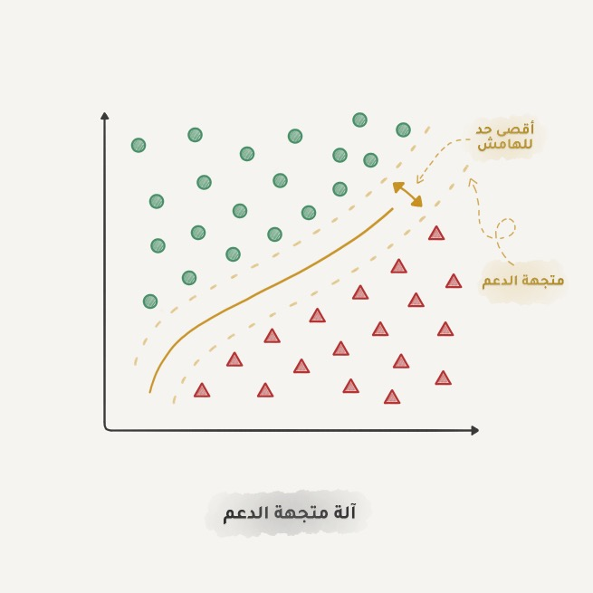

يوجد جانب مفيد جداً في التصنيف وهو اكتشاف الشذوذ، عندما لا تنتمي نقطة بيانات إلى أي من الأصناف يتم إبرازها بوضوح. تستخدم هذه الميزة في الطب وصور الرنين المغناطيسي، تبرز أجهزة الكمبيوتر جميع المناطق المشبوهة أو الانحرافات في التحاليل المخبرية. يستخدم أيضاً لاكتشاف السلوك الغير طبيعي للمتداولين في أسواق الأسهم. فعندما نعلم الكمبيوتر الأشياء الصحيحة فإنه يتعلم الأشياء الخاطئة تلقائياً. 

تستخدم هذه الأيام الشبكات العصبية بشكل كبير للتصنيف، حيث أنها صنعت لهذا الغرض، لكن القاعدة العامة هي أنه كلما زاد تعقيد البيانات زاد تعقيد الخوارزميات. فاختر الأساليب الكلاسيكية للبيانات النصية والرقمية والجداول فإنها تتعلم اسرع وتؤدي عملها بشكل أوضح، أما بالنسبة للصور ومقاطع الفيديو وجميع الأشياء المعقدة المتعلقة بالبيانات الضخمة فانظر إلى الشبكات العصبية فستعمل أفضل.

قبل خمس سنوات فقط، كان SVM يستخدم حتى في تصنيف الوجوه، لكن اليوم أصبح من السهل جداً الاختيار من بين مئات الشبكات العصبية المدربة مسبقاً لهذا الغرض، مع ذلك لم يتغير شيء كبير لفلاتر رسائل التصيد لاتزال تعمل على SVM وليس هناك سبب وجيه لتبديله في الكثير من الحالات.

### الانحدار Regression

"نعم! يعتبر رسم خط يصل نقاط البيانات كأسعار الأسهم على محور والزمن على محور آخر، من أهم تطبيقات تعلم الآلة"

يستخدم اليوم في:
> توقع مدة الرحلة حسب وقتها، وتحليل حجم العرض والطلب، والتشخيص الطبي، وأي ارتباط بين قيمة والزمن

الخوارزميات الشائعة في الانحدار:
> [Linear](https://www.youtube.com/watch?v=nk2CQITm_eo) and Polynomial Regressions

يماثل الانحدار التصنيف غير أننا نتوقع رقماً بدلا من صنف، كالمثال تنبؤ سعر السيارة بناء على عدد الأميال التي قطعتها، وتنبؤ مدة الرحلة حسب وقتها، وحجم الطلب من خلال نمو الشركة وما إلى ذلك. أفضل التطبيقات للانحدار هو عندما يكون الزمن أحد العوامل أو ميزات الدخل.

  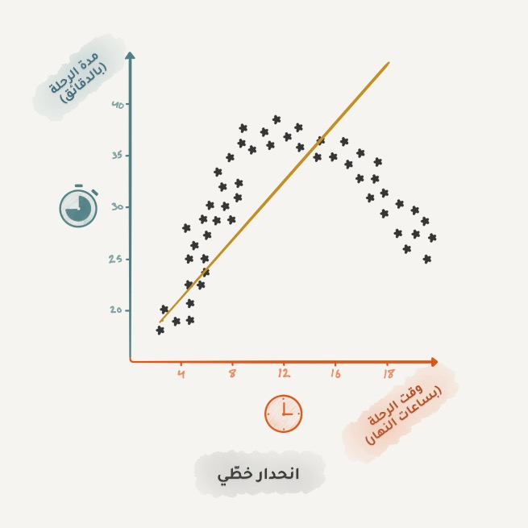
  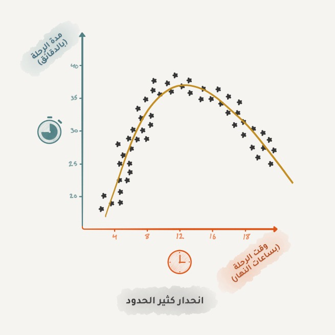

يعتبر الانحدار من الأساسيات للذين يعملون في مجال التمويل والتحليل، حتى أنك تجده في برنامج الإكسل سهل وسلس الاستخدام. تحاول الآلة ببساطة رسم خط يمثل متوسط الارتباط للنقاط البيانية، لكن على عكس أستاذك في الثانوي 😉 تقوم الآلة بذلك بدقة أكبر عن طريق حساب متوسط النقاط ضمن فاصل معين.

عندما يكون الخط مستقيماً فهو انحدار خطي، وعندما يكون منحنياً يكون متعدد الحدود. هذان النوعان الرئيسيان من الانحدار، أما ابن البطة السوداء فهو الانحدار اللوجستي لاتدعه يخدعك فهو طريقة للتصنيف وليس انحداراً.

لابأس من بعض الخلط بين التصنيف والانحدار، فالعديد من طرق التصنيف يمكن تحويلها إلى انحدار بعد بعض التعديلات، حيث أنها (طرق التصنيف) لا تعطي فقط صنف الكائن، بل يمكنها أيضاً الإشارة إلى مدى قربه من الكائن الآخر وهنا يبدأ التصنيف بالتحول إلى انحدار.

### 2.1 التعلم بدون معلم
بدأت أساليب التعلم بدون معلم في التسعينيات من القرن الماضي، واستخداماتها أقل من التعلم بمعلم لكن أحياناً ليس لدينا خيار.

فالبيانات المسماة Labeled تعد من أنواع الترف عند علماء البيانات، لكن ماذا لو كنت أرغب في إنشاء نموذج يقوم بتصنيف أنواع الحافلات؟ هل يجب أن ألتقط صوراً لملاين الحافلات في الشوارع وأضع اسم على كل من هذه الصور يدوياً؟ سيستغرق ذلك حياتي كلها، وأنا عندي أولاد لقوم بتربيتهم 😂.

لكن وبفضل التقسيم الاجتماعي الطبقي، لدينا ملايين العمال والخدمات الرخيصة - مثل تلك الموجودة على Mechanical Turk - مستعدين لهذا العمل مقابل 0.05 دولار، وهكذا تحصل على بيانات مصنفة وجاهزة لتنشئ نموذجك الخاص.

أو يمكننا محاولة استخدام أساليب التعلم بدون معلم التي عادة ماتكون مفيدة في التحليل الاستكشافي للبيانات وليس كخوارزمية يمكن استخدماها بشكل مستقل، تبدأ بإعطاء الآلة كمية من البيانات وتراقبها، هل هناك أي مجموعات أو عناقيد؟ أي علاقة ملموسة في بينها؟ لا! إذا تابع التحليل وتجريب أسلوب اخر. فأنت من أراد العمل في علم البيانات.

### العنقدة Clustering

  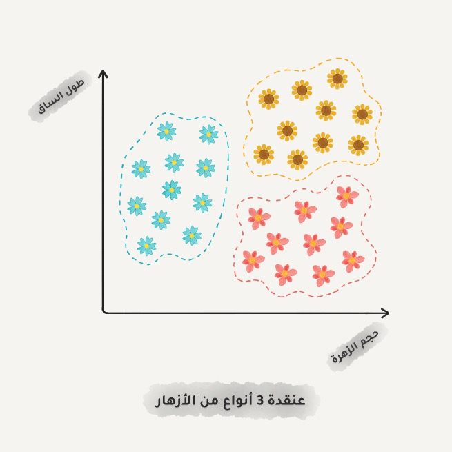

"تقسم البيانات بناء على ميزات غير معروفة، ويختار الجهاز أفضل طريقة لذلك"

تستخدم اليوم في:
- تقسيم السوق إلى مجموعات
- لدمج النقاط المتشابهة على الخريطة
- ضغط الصور
- تحليل البيانات الجديدة وتسميتها
- الكشف عن سلوك المستخدمين غير الطبيعي

الخوارزميات الشائعة: K-means_clustering، Mean-Shift، DBSCAN

العنقدة كخوارزميات التصنيف لكن دون أصناف معرفة مسبقاً، يشبه الأمر فرز الجوارب حسب اللون عندما لا نتذكر كل الألوان التي لدينا - ودائماً لانتذكر 🤦🏻‍♂️. تحاول خوارزمية العنقدة العثور على الكائنات المتشابهة من خلال بعض الميزات ثم دمجها في كتلة واحدة. تصبح كل الكائنات التي لديها ميزات متشابهة في فصل واحد. وباستخدام بعض الخوارزميات الأخرى يمكننا تحديد عدد الفصول التي نحتاج إليها بشكل دقيق.

تعتبر الدبابيس على الخرائط مثال جيداً على العنقدة، فعندما تبحث عن جميع المقاهي الموجودة حولك، تقوم خوارزمية العنقدة بتجميع هذه المقاهي على شكل نقاط تحتوي على عدد هذه المقاهي، لأنه وخلاف لذلك سيجمد المتصفح وهو يحاول رسم دبوس لجميع المقاهي التي يبلغ عددها الآلاف.

تستخدم تطبيقات الصور في هواتفنا خوارزميات عنقدة أكثر تعقيداً، تبحث عن الوجوه في الصور التي لديك ثم تقوم بإنشاء ألبوم لأصدقائك كلاً على حدى. تحاول هذه الخوارزميات العثور على ميزات مشتركة في الوجوه ثم تقوم بتجميع كافة الصور التي تحتوي هذه الوجوه تحت ألبوم واحد وهكذا تكون قد كونت عدة عناقيد كل منها يبدأ بالألبوم ويحتوي على مجموعة من الصور. لاحظ أن هذه الخوارزميات لا تعرف عدد أصدقائك ولا كيف يبدون لكنها قادرة على تجميعهم بالنظر إلى ميزات وجوههم فقط.

ضغط الصور من المشاكل الشائعة التي تعالجها خوارزميات العنقدة. يمكننا ضبط لوحة الألوان على 32 لوناً عند حفظ صورة بصيغة PNG على سبيل المثال، هذا يعني أن خوارزمية العنقدة ستجد جميع وحدات البكسل الحمراء، وذلك بحساب متوسط اللون الأحمر وإعادة ضبطه للون الذي تم تحديده من بين ال 32 لون، ما يعني ان الصورة الناتجة ستحوي ألواناً أقل بالتالي حجم الصورة أصغر.

لكن ستواجه مشكلة مع الألوان مثل اللون السماوي، فهل هو أخضر؟ أم أرزق؟ هنا تأتي خوارزمية K-Means:

تقوم باختيار 32 لون بشكل عشوائي من لوحة الألوان، تسمى هذه النقاط الوسطى، ثم ترتبط كل نقطة من ال 32 بالألوان الأقرب لها على اللوحة، وهكذا نحصل على 32 مجرة مركزها النقاط الوسطى، ثم نقوم بتحريك النقطة الوسطى إلى مركز مجرتها ونكرر ذلك حتى تتوقف النقطة الوسطى عن الحركة. وهاهي 32 مجموعة محددة ومستقرة من الألوان.

البحث عن أفضل الأماكن لتوزيع عربات الطعام في المدينة

يبدو البحث عن العناقيد في حالة ضغط الصور سهلاً، لكن في الحياة الواقعية لاتكون العناقيد دائماً على هذا الشكل. تخيل أنك جيولوجي تبحث عن المعادن في الأرض، تأخذ العناقيد -في هذه الحالة - أشكال غريبة ومتداخلة ولا تعرف حتى كم عدد هذه العنقايد المتوقع هل هي عشرة؟ عشرين؟ مئة؟

تأتي خوارزمية DBSCAN لتعثر على هذه الامتدادات من المعادن، لنفرض أن النقاط هي أشخاص في ساحة عامة في البلدة، ابحث عن أي ثلاثة أشخاص يقفون بالقرب من بعضهم البعض واطلب منهم أن يمسكوا أيادي بعضهم، ثم البدء بمسك أيادي جيرانهم الذين تصل إليهم أيديهم فقط، وهكذا دواليك حتى لا يستطيع أحد أن يمسك بيد أي شخص آخر وهذه هي مجموعنا الأولى. كرر العملية حتى يتم تجميع كافة الأشخاص. يعتبر الشخص الباقي الذي ليس لديه من يمسك بيده حالة شاذة.

يمكن استخدام العنقدة للكشف عن الحالات الشاذة، تماماً مثل التصنيف. إذا كنت تعتقد أن أحد المستخدمين يتصرف على غير طريقته المعتادة بعد تسجيل الدخول فدع التطبيق يحظره مؤقتاً ثم انظر إذا كان سيقوم برفع تذكرة للدعم الفني أم لا فربما يكون روبوتاً. حتى أننا لانحتاج إلى معرفة ماهو سلوكه المعتاد فقط يمكننا أن نعط قاعدة بيانات الحركات التي يقوم بها المستخدم إلى نموذج DBSCAN ويمكنها أن تميز ما إذا كان هذا المستخدم حقيقاً أم روبوتاً.

لا تعمل أساليب العنقدة بالكفاءة التي تعملها بها أساليب التصنيف في هذه التطبيقات، لكن لا بأس من تجربتها.

### تقليل الأبعاد - التعميم Dimensionality Reduction - Generalization

"تجمع عدة ميزات في مميزات أكثر تجريداً ذات مستوى عالي"

يستخدم اليوم في:
- أنظمة التوصية ⭐
- الرسوم البيانية الجميلة
- نمذجة المواضيع والبحث في الوثائق المشابهة
- تحليل الصور المزيفة

الخوارزميات الشائعة: Principal Component Analysis (PCA), Singular Value Decomposition (SVD), Latent Dirichlet allocation (LDA), Latent Semantic Analysis (LSA, pLSA, GLSA), t-SNE (للرسوم البيانية)

استخدمت هذه الأساليب سابقاً من قبل علماء البيانات المتشددين، الذين كان عليهم أيجاد شيء ينتفع به في كميات ضخمة جداً من الجداول والأرقام، شريطة أن يكون هذا الشيء ملموساً وواضحاً. فعندما لم تعد تساعد مخططات الإكسل استعملوا هذه الطرق لإيجاد الأنماط والتعبير عنها فحصول على أولى أساليب تقليل الأبعاد وتعلم الميزات (هي عملية إيجاد الميزات في البيانات باستخدام خوارزمية التعلم، وليس استخراجها بالطرق التقليدية).

إسقاط بيانات ثنائية البعد على خط مستقيم

يميل الأشخاص دائماً إلى استخدام التجريد للتعبير عن مجموعة من الأفكار وليس استخدام مجموعة مجزأة من الميزات. مثلاً يمكننا التعبير عن كل الكلاب برسم تجريدي لمثلثين للآذان وأنوف طويل وذيول كبيرة في صورة تجريدية معقولة.

يفتقد هذا الرسم التجريدي إلى الكثير من التفاصيل هذا صحيح، لكن يبقى التجريد ذو فائدة كبيرة عند تسمية الأشياء وشرحها، إضافة إلى أن مثل هذه الأساليب تتعلم بشكل أسرع، ولاتفرط كثيراً في التعميم وتستخدم عدد أقل من الميزات.

أصبحت هذه الخوارزميات إدارة رائعة لنمذجة المواضيع، إنها تمكننا من تجريد المعاني من كلمات محددة وهذا ما يفعله التحليل الدلالي الكامن LSA الذي يعتمد على عدد المرات التي يرى فيها كلمة في موضوع محدد، فالمصطلحات التقنية تتواجد بكثر في المقالات التقنية، وتتواجد أسماء السياسين في الغالب في الأخبار السياسية وهكذا.

يمكننا تكوين عناقيد من جميع الكلمات الموجودة في المقالات، لكننا سنفقد العلاقات بين هذه الكلمات - مثل معنى كلمة بطارية في المقالات التقنية هي مخزن الطاقة وفي المقالات السياسية هي منظومات الدفاع الجوي - هذا صحيح لكن LSA تتعامل مع هذا بشكل صحيح ولهذا يطلق عليها اسم "الدلالة الكامنة"

أي أننا بحاجة إلى ربط الكلمات والمستندات بميزة واحدة وذلك للحفاظ على هذه العلاقات الكامنة، وهنا يأتي التحليل المفرد SVD ليقوم بهذه المهمة، ويكشف عن عناقيد المواضيع من الكلمات المرئية معاً.

تعتبر أنظمة التوصية والتصفية التعاونية استخداماً شائعاً لأساليب تقليل الأبعاد، فإذا تم استخدامه لتجريد تقيمات المستخدمين فسنحصل على نظام رائع للتوصية بالأفلام والموسيقى، وحتى الألعاب.

في أنظمة التوصية تقوم الآلة بإيجاد التجريد وبالكاد يمكن فهمه، لكن يمكن رؤية بعض الارتباطات عند التفحص الدقيق لهذه التوصيات، فبعضها يرتبط بعمر المستخدم (فالأطفال يلعبون ماريو، ويشاهدون طيور الجنة)، والبعض الآخر يرتبط بنوع الفيلم أو هوايات المستخدم.

تستخرج الآلة هذه المفاهيم المجردة عالية المستوى - حتى بدون أن تفهمها - من معرفة تقييمات المستخدمين للأفلام أو الألعاب فقط.

### تعلم قواعد الربط Association Rules Learning
"يبحث عن العلاقات والأنماط بين تسلسل الفواتير المتتابعة"

يستخدم اليوم في:
- التنبؤ بالمبيعات والخصومات
- تحليل البضائع المباعة معاً
- توزيع المنتجات على الرفوف
- تحليل أنماط تصفح الإنترنت

الخوارزميات الشائعة: Apriori و Euclat و FP-Growth

يشمل هذا جميع طرق تحليل عربات التسوق، وأتمتة استراتيجيات التسويق، وأي مهمات أخرى تتعلق بالأحداث، فعندما يكون لدنيا تسلسل من الأحداث ونريد العثور على الأنماط فيها يمكننا تجريب هذه الخوارزميات.

في متاجر البيع بالتجزئة إذا كان العملاء يشترون 6 علب مياه غازية ويذهبون للدفع. هل يجب أن نضع الفستق السوداني والتخليطة على الطريق؟ كم مرة يشتريهما الزبائن معاً؟ وواضح أن هذه القاعدة تعمل مع الببسي والفستق السوداني، لكن ما هي التسلسلات الأخرى التي يمكننا توقعها؟ هل يمكن لتغيير بسيط في ترتيب البضائع أن يؤدي إلى زيادة كبيرة في الأرباح؟

تنطبق نفس الأسئلة في التجارة الإلكترونية في السؤال الملح هناك هو مالذي سيشترونه الزبائن في المرة القادمة؟

لا أعرف لما لا يوجد تفصيل كافي عن خوارزميات تعلم قواعد الربط في الكتب والإنترنت، لكن بالمجمل تعتمد الأساليب الكلاسيكية منها على النظر المباشر في جميع البضائع المباعة باستخدام أشجار القرار أو المجموعات، هذه الخوارزميات يمكنها فقط البحث عن أنماط شراء المستخدم لكنها لاتستطيع التعميم وإعادة إنتاج هذه الأنماط على الأمثلة الجديدة.

يقوم كل متجر تجزئة كبير ببناء حل خاص به، لذلك لا توجد ثورات في هذا المجال يمكننا الرجوع إليها دائماً. فآخر ما توصل إليه العلم في هذا المجال هو أنظمة التوصية، وقد لا أكون على بأي تطورات كبيرة في هذا المجال، رجاء شاركوني بأي شيء عن هذا الموضوع إذا كان لديكم.

## الجزء 2. التعلم المعزز
"كالروبوات التي يلقى بها في متاهة وتستطيع إيجاد المخرج بمفردها"

يستخدم اليوم في:
- السيارات ذاتية القيادة
- المكانس الروبوتية
- ألعاب الفيديو
- أتمتة التداول

الخوارزميات الشائعة: Q-Learning, SARSA, DQN, A3C, Genetic algorithm

هذا الجزء الذي أميل إلى تسميته ذكاء اصطناعياً حقيقياً. يتم وضع التعلم المعزز في كثير من المقالات بين التعلم بمعلم والتعلم بدون معلم على الرغم من أن لاشيء مشترك بينهما، فهل هذا بسبب الاسم؟ لا أدري.

يستخدم التعلم المعزز في الحالات التي لا تتعلق فيها المشكلة بالبيانات، ولكن في البيئة التي تعيش فيها. مثل ألعاب الفيديو أو مدينة للسيارات ذاتية القيادة.

المعرفة بجميع قواعد السير على جميع الطرق لن تعلم السائق الآلي كيفية القيادة على الطريق. فنحن لا نستطيع توقع جميع المواقف المحتملة للقيادة على الطريق مهما جمعنا من بيانات، وهذا هو السبب في أن هدف التعلم المعزز هو تقليل الأخطاء وليس التنبؤ بكل الحركات.

تعتبر فكرة البقاء والتعايش في البيئة التي يعمل بها الروبوت هي الفكرة الأساسية للتعلم المعزز. فوضعه في الحياة الواقعية وتركه يتحرك بأي اتجاه ومعاقبته إذا أخطأ و ومكافئته إذا أصاب، هي تماماً ما نفعله مع أطفالنا ليتعلموا، فإذا فعلوا خيراً حمدنه لهم وإن كان غير ذلك وجهناهم.

بناء مدينة افتراضية والسماح للسيارات ذاتية القيادة بتعلم كل حيل القيادة فيها أولا، هي الطريق الأكثر فعالية وهذا بالضبط مايقوم به المهندسون لتدريب السائقين الآليين في الوقت الحالي. فهم يبنون مدينة افتراضية يملؤها المارة والمحلات ويضغون فيها السيارات لتتعلم صدم أقل عدد ممكن من الأشخاص. وعندما نثق بالروبوت بدرجة معقولة في هذه المدينة الاصطناعية، فإنه يطلق للاختبار في الشوارع الحقيقية.

هناك طريقتان مختلفتان: بنموذج Model-Based، وبدون نموذج Model-Free.

الطريقة ذات النموذج تعني أن السيارة تحتاج إلى حفظ الخريطة بكافة طبقاتها بالكامل، وتعد قديمة نوعاً ما حيث اتضح أنه من المستحيل على السيارة ذاتية القيادة حفظ الكوكب أسره بما فيه من كائنات لا يجب الاصطدام بها!

في التعلم الذي لايحوي على نموذج، لا تحفظ السيارة كل الحركات ولكنها تحاول تعميم المواقف والتصرف بعقلانية مع الحصول على أكبر قدر من المكافأة.

هل تتذكر الأخبار حول فور الذكاء الاصطناعي على أفضل لاعب في لعبة Go؟ تم ذلك بالرغم أنه وقبل فترة وجيزة اثبت العلماء أن عدد التوليفات في هذه اللعبة أكثر من عدد الذرات في الكون.

هذا ما نقصده أن الآلة لاتستطيع تذكر جميع الاحتمالات وبالتالي الفوز ب Go (كما كان في لعبة الشطرنج سابقاً)، إنها ببساطة تختار أفضل خطوة لكل موقف، وهذا ما حقق أداء جيداً بما يكفي للتغلب على افضل لاعب في العالم.

هذه الطريقة هي المفهوم الأساسي وراء خوارزمية Q-Learning ومشتقاتها (SARSA & DQN). يشير حرف Q في الاسم إلى كلمة الجودة، حيث يتعلم الروبوت أداء أكثر الإجراءات "نوعية" في كل موقف ويتم حفظ جميع المواقف كعملية ماركوف بسيطة.

يمكن لمثل هذه الآلة اختبار مليارات المواقف في بيئة افتراضية، وتذكر الخيارات التي أدت إلى مكافأة أكبر. لكن كيف يمكنها التميز بين المواقف التي سبق رؤيتها والحالات الجديدة تماماً؟ فإذا كانت السيارة ذاتية القيادة عند تقاطع طريق وتحولت إشارة المرور إلى اللون الأخضر، فهل هذا يعني أنها يمكن أن تنطلق الآن؟ ماذا لو كانت هناك سيارة إسعاف مسرعة عبر الشارع الآخر؟

الجواب اليوم هو لا أحد يعمل. فلاتوجد إجابة سهلة لذلك. يبحث المهندسون عن إجابة باستمرار لكن دون جدوى في الوقت الحالي سوى بعض الحلول البديلة. فبعض المهندسين يقومون بكتابة حلول لكافة المواقف يدوياً للتعامل مع الحالات الاستثنائية كهذه. ويتعمق آخرون بجعل الشبكات العصبية تقوم بمهمة أكتشاف الخيار الذي يجب أن تسلكه السيارة، وقد قاد هذا التفكير إلى تطوير Q-Learning إلى Deep Q-Network (DQN) ولكنها ليست بالحل السحري.

يبدو التعلم المعزز للشخص العادي وكأنه ذكاء اصطناعي حقيقي. ذلك أنه يجعلك تنبهر بما يفعله حيث تقوم الآلة باتخاذ القرارات في مواقف الحياة الحقيقية! تم الترويج لهذا الموضوع كثير فهوى يتقدم بوتيرة مذهلة ويتقاطع مع الشبكات العصبية حتى تقوم المكانس الروبوتية بتنظيف الأراضي بدقة اكبر. يبدو عالم مذهل من التقنيات!

كانت الخوارزمية الجينية شائعة جداً عندما كنت طالب في الجامعة. تم تشبيه الأمر حينها بمجموعة من الروبوتات التي تلقى في بيئة واحدة وجعلهم يحاولون الوصول إلى هدفهم حتى يموتوا دونه. ثم نختار الأفضل منهم ونحول بعض جيناتها عشوائياً ونعيد تشغيل المحاكاة. وإن شاء الله بعد بضع مليارات من السنين ربما نحصل على مخلوق ذكي. هذا كان مفهوم التطور في أفضل حالاته.

تعتبر الخوارزمية الجينية جزء من التعلم المعزز وأثبتت الممارسة أنها تمتلك الميزة المهمة لجعلها تتطور، لكن لا تجد اهتمام كافي بها في هذا المجال.

## الجزء 3. أساليب المجموعات
"تخيلها كمجموعة من أشجار القرار الغبية، تمحو أخطاء بعضها بعضاً"

تستخدم اليوم في:
- كل الخوارزميات الكلاسيكية (لكنها تعمل بشكل أفضل)
- أنظمة البحث
- الرؤية الحاسوبية
- كاشف الكائنات

الخوارزميات الشائعة: Random Forest, Gradient Boosting

تعتبر المجموعات والشبكات العصبية من الطرق الحديثة والكبيرة التي تمهد الطريق نحو شركات تقدم حلول متفردة، حيث تقدم المجموعات أكثر النتائج دقة وتستخدم على نطاق واسع في مشاريع البيئة الحية.

حصلت الشبكات العصبية على كل الأضواء هذه الأيام، لكن تبقى أساليب المجموعات مثل "التعزيز" و"التعبئة" ذات انتشار واسع واستخدامات مفيدة.

تكمن فكرة بسيطة للغاية وراء كل الفعالية التي تأتي مع أساليب المجموعات. وهي أن مجموعة من الخوارزميات الغير الفعالة التي تجمع لتصحح أخطاء بعضها البعض، ستعطي جودة إجمالية أكبر للنظام ككل حتى من أفضل الخوارزميات عندما تعمل بمفردها.

ستحصل على نتائج أفضل حتى لو أخذت اكثر الخوارزميات غير المستقرة التي تتأثر بأي شذوذ بالبيانات على الدخل. يعتبر الانحدار وشجرات القرار من أكثر الخوارزميات حساسية لأي قيمة شاذة بالبيانات في عندما تصادفها في الدخل فتوقع أن خرجها سيكون شيء جنونياً.

وهذا ما نحتاجه في الحقيقة

فأي من الخوارزميات التي نعرفها يمكن أن نشكل منها مجموعة 
يمكن أن نشكل مجموعة من أي من الخوارزميات التي نعرفها، ذلك عن طريق وضع مجموعة من خوارزميات التصنيف، مع خوارزمية انحدار طازجة، ولا ننسى أدوات قياس دقة الأداء وألف مبروك لدينا مجموعة من الخوارزميات التي تعمل مع بعضها.

لا تجرب تجميع خوارزميات مثل KNN وBayes على الرغم من كلاسيكيتها إلا أنها مستقرة ويمكن التنبؤ بمخرجاتها، بدلا من ذلك استخدم أي من الطرق الثلاثة التالية لإنشاء المجمومعات، فقد تم اختبارها حقاً في تطبيقات على البيئة الحية

**التكديس**
قم بتمرير مخرجات عدة نماذج مكدسة على توازي إلى نموذج أخير ليتخذ القرار النهائي. لكن تأكد من اختلاف أنواع النماذج فتمرير نفس البيانات على خليط من النماذج من نفس الخوارزمية لن يكون له أي معنى، لكن اختيار الخوارزميات متروك لك تماماً، ومع ذلك غالباً ما يكون الانحدار هو نموذج اتخاذ القرار الأخير.

**التعبئة Bagging - Bootstrap AGGregatING**
ندرب عدة نماذج من نفس الخوارزمية، لكن كل نموذج على مجموعة فرعية من البيانات الأصلية ثم نأخذ متوسط هذه النماذج كقرار نهائي.

قد تتكرر البيانات في المجموعات الفرعية بشكل عشوائي، فمثلاً من المجموعة "1-2-3" يمكننا الحصول عشوائياً على مجموعات فرعية مثل "3-3-1" و"2-2-3" و"2-1-3" ولابأس في ذلك. سندرب عدة نماذج من نفس الخوارزمية على مجموعات البيانات الفرعية هذه، ثم سيكون التوقع الأخير عن طريق التصويت بالأغلبية.

خوارزمية Random Forest من أشهر الأمثلة على التعبئة Bagging حيث نقوم بتعبئة مجموعة من أشجار القرار تم تدريبها على مجموعة عشوائية من البيانات داخل غابة واحدة ونرى مالذي تتنبأ به معظم هذه الأشجار ويكون هو القرار النهائي.

تعتبر خاصية تحديد الوجه في كاميرات هواتفنا اليوم من التطبيقات الشائعة لغابات شجرات القرار العشوائية، فعندما تفتح تطبيق الكاميرا وترى أنه يرسم مربع حول وجوه الأشخاص فمن المرجح أن يكون هذا نتيجة عمل Random Forest. ستكون الشبكات العصبية بطيئة في هذه الحالة فلايمكن تشغيلها في الوقت الفعلي.، لكن التعبئة مثالية في هذه الحالة حيث يمكن حساب قيم الأشجار هذه على معالج كرت الشاشة بسرعة كبيرة. لذلك نرها في بعض المهام وذلك لقدرتها على العمل بالتوازي مقابل خسارة بسيطة في دقة التوقع فدائماً مانرى هذه الموازنة.

**التعزيز** 
يتم تدريب النماذج واحدا تلو الآخر بالتسلسل، يركز كل نموذج معظم اهتمامه على البيانات التي أخطأ في توقعها النموذج الذي يسبقه، فيعزز بذلك قدرة النظام ككل على التنبؤ بدقة أعلى.

وكما هو الحال في أسلوب التعبئة، فإننا نستخدم مجموعات فرعية من بياناتنا ولكن هذه المرة لا يتم إنشاء هذه المجموعات عشوائياً. إنما كل عينة فرعية تكون جزءاً من البيانات التي فشل النموذج السابق في معالجتها، بالتالي فإننا نصنع خوارزمية جديدة تتعلم إصلاح أخطاء الخوارزمية السابقة.

تكمن الميزة الرئيسية هنا في دقة التصنيف العالية جداً، والتي تحسد عليها من معظم الخوارزميات الأخرى، لكن كما هو الحال هناك دائماً سيئة لكل ميزة فإن هذا الأسلوب في التجميع لايعمل على التوازي لكن بالمجمل لايزال اسرع من الشبكات العصبية. وكأنه سباق بين شاحنة وسيارة سباق، تستطيع الشاحنة حمل كمية كبيرة جداً من البيانات، لكن إن أردت السرعة فإستقل سيارة السباق.

إذا أردت مثالاً واقعياً للتعزيز ففتح Facebook وابدأ في الكتابة في مربع البحث، فإذا قرأت [هذه المقالة](https://engineering.fb.com/2017/03/27/ml-applications/evaluating-boosted-decision-trees-for-billions-of-users/)، ستتمكن من سماح حفيف الأشجار يأتي من تلك الغابات التي تعمل على فرز النتائج حسب ما يلائمك.

## الجزء 4. الشبكات العصبية والتعلم العميق
"محاولة لمحاكة طريقة عمل الدماغ البشري، بعد التقدم الكبير في إمكانيات الحوسبة المتوازية"

تستخدم اليوم في:
- استبدال جميع الخوارزميات السابقة
- تحديد الكائنات على الصور ومقاطع الفيديو
- التعرف على الكلام
- معالجة الصور
- الترجمة الآلية

البنى الشائعة: Perceptron, Convolutional Network (CNN), Recurrent Networks (RNN), Autoencoders

إذا لم يحاول أحدهم أن يشرح لك الشبكات العصبية بتشبيهها بالدماغ البشري، فأنت محظوظ :) وأرجو أن تخبرني بسرك :]. لذلك دعني أشرحها بطريقتي

فأي شبكة عصبية هي مجموعة من عصبونات (الخلايا العصبية) والموصلات (التي تصل هذه الخلايا فيما بينها).

**العصبون** هو تابع رياضي يأخذ عدة قيم كدخل، وينفذ عليها مهمة ما، ثم يعيد قيمة واحدة كخرج.

**الموصلات** تشبه قنوات النقل بين عصبونات، فتربط خرج عصبون بدخل لآخر حتى يتمكوا من إرسال القيم لبعضهم البعض، يحتوي كل موصل على وزن يحدد قوة الإشارة المنقولة فإذا كانت القيمة المنقولة 10 ووزن الموصل 0.5 فإن الإشارة ستنتقل نصفها فقط 5 إلى العصبون التالي.

تخبر هذه الأوزان العصبونات بالاستجابة لأحد قيم الدخل أكثر من الأخرى، ويتم تعديل هذه الأوزان أثناء عملية التدريب وهذا هو أساس تعلم الشبكات العصبية، وهذا كل مافي الأمر.

تترتب الخلايا العصبية على شكل طبقات دخل كل طبقة هو خرج الطبقة التي تسبقها، وتنتقل البيانات البيانات بين هذه الطبقات في اتجاه واحد من مدخلات الطبقة الأولى إلى مخرجات الطبقة الأخيرة.

إذا وضغنا عدداً كافياً من الطبقات ووضعنا الأوزان بشكل صحيح، وادخل صورة الرقم أربعة على الطبقة الأولى، سيتم تفعيل الخلايا العصبية المرتبطة ببعضها من طبقة إلى أخرى حتى يضيء أخيراً الخرج الذي يمثل الرقم أربعة، وتتعرف الشبكة بشكل كامل على محتوى هذه الصورة.

عند برمجة شبكة عصبية في مشروع واقعي فلا أحد يمثل الخلايا العصبية والموصلات بهذا الشكل إنما يتم تمثيلها على شكل مصفوفات، ويتم حساب خرج كل طبقة إلى الطبقة التالي عن طريق جداء لهذه المصوفوات وذلك للحصول على أداء افضل. يصف مقطع [الفيديو هذا](https://www.youtube.com/watch?v=aircAruvnKk) كيف تتم العملية برمتها بطريقة سهلة وباستخدام مثال التعرف على الأرقام المكتوبة بخط اليد.

بعد بناء الشبكة، تكون المهمة هي تحديد الطرق المناسبة حتى تتفاعل الخلايا العصبية بشكل صحيح مع الإشارات الواردة، تذكر أن عينات البيانات تتكون من دخل وخرج وكذلك الشبكة لها طبقة دخل وأخرى للخرج، سنعطي الشبكة جزء الدخل من البيانات على دخلها، ولتكن صورة تحتوي الرقم 4، ثم نقوم بطرح خرج الشبكة من جزء الخرج من البيانات، فإذا لم يكن الناتج قريباً من الصفر نطلب منها ان تكيف أوزانها لكي تعطي الرقم 4 على الخرج وبالتالي يكون ناتج الطرح أقرب ما يكون من الصفر.

تعطى كافة الأوزان قيم عشوائية في البداية، ذلك يعني أن أول صورة تراها الشبكة ستعطي خرجاً عشوائياً أيضاً لأن الأوزان لم تضبط بالشكل المناسب بعد. نقارن مدى اختلاف النتيجة عن النتيجة الصحيحة، ونبدأ باجتياز الشبكة للخلف من طبقة المخرجات حتى طبقات المدخلات، ونمر على كل وزن ونخبره أن قد قمت بتنشيط الموصل بين هاتين الخليتين، لكن كان هذا التنشيط أكثر أو أقل من اللازم، ونخبر بتعديل وزنه قليلاً وهكذا.

بعد تنفيذ مئات وربما آلاف من الدورات السابقة "الاستنتاج-التدقيق-الضبط" يظهر الأمل في أن هذه الأوزان قد صححت من وضعها وبدأت الشبكة تعمل على النحو الصحيح. يسمى هذا الأسلوب علمياً Backpropagation. الطريف في الموضوع أن هذه الطريقة احتاجت إلى عشرين عاماً للتوصل إليها، وقبل ذلك كانوا مصرين على دراسة الشبكات العصبية بطرق اخرى.

يصف [هذا الفيديو](https://www.youtube.com/watch?v=IHZwWFHWa-w) أيضاً هذه العملية بعمق أكبر، لكن بطريقة واضحة وسهلة.

يمكن لشبكة عصبية مدربة جيداً أن تعمل عمل أي من الخوارزميات الموضحة في هذه المقالة، وغالباً ما تعمل على نوح أدق. هذه الميزة هي ماجعل الشبكات العصبية ذات شعبية واسعة. ثم إن شكلها على الورق والموصلات المتشابكة فيها تشبه تشابكات الدماغ البشري ماجعل الصحف تركز على أنها ستكون بديلاً له وهذا شيء آخر لعب دوراً في شهرتها أيضاً.

اعتقد أنه اصبح واضحاً أن تدريب الشبكات العصبية التي تحتوي على عدد كبير من الطبقات يحتاج إلى قوة حسابية كبيرة جداً لايمكن حتى تصور أنها موجودة في تلك الأيام، لكن تفوق أي جهاز ألعاب ببطاقة شاشة GeForces على مراكز بيانات كاملة كانت موجودة في تلك الحقبة من الزمن، وذلك ما لم يكن يحلم به مهندسي تعلم الآلة لتدريب الشبكات العصبية الكبيرة كفاية لحل مشاكل الواقع.

وهكذا خلال العشر سنوات السابقة ظهر التعلم العميق مع نمو القدرة الكبيرة على الحوسبة، هذا [جدول زمني](https://en.wikipedia.org/wiki/Timeline_of_machine_learning) لتعلم الآلة يصف دوامة الأمل والتشائم خلال العقود المنصرمة.

حققت الشبكات العصبية الترشيحية CNN في عام 2012 فوزاً ساحقاً في مسابقة ImageNet ماجعل العالم يتذكر فجأة طرق التعلم العميق التي تم دراستها في تسعينيات القرن الماضي. 

يكمن الاختلاف بين التعلم العميق والشبكات العصبية الكلاسيكية في طرق التدريب الجديدة التي يمكنها أن تتعامل مع شبكات أكبر وأعمق. وتفرق النظريات فقط بين التعلم العميق وغير عميق في وقتنا الحاضر، ففرق بين قد اضمحل بعد التقدم الكبير الذي حصل في مكتبات تعلم الآلة، وكمهندس تعلم آلة ستستخدم مكتبات مشهورة جداً لبناء هذه الشبكات مثل Keras, Tensorflow, PyTorch لبناء حتى الشبكات الصغيرة من خمس طبقات. ذلك أن هذه المكتبات أسهل بكثير من جميع الأدوات والمكتبات التي كانت موجودة سابقاً لتعليم الشبكات العصبية الكلاسيكية.

لنتحدث عن أهم بنيتين للشبكات العصبية في وقتنا الحاضر.

**الشبكات العصبية الترشيحية Convolutional Neural Networks CNN**
هي الأشهر على الإطلاق في وقتنا الحالي، حيث تستخدم للبحث عن الكائنات في الصور، أو في مقاطع الفيديو، والتعرف على الوجوه، وإنشاء و تحسين وتحويل الصور، وإنشاء التأثيرات مثل الحركة البطيئة وتحسين جودة الصورة. تستخدم في جميع حالات الرؤية الحاسوبية حيث تعمل بكفائة في هذا المجال.

](/assets/detectron.jpg)

تكمن المشكلة مع الصور دائماً في صعوبة استخراج الميزات منها، فالنصوص يمكن ان تقسم حسب الجمل، أو حسب بعض الكلامات المفتاحية الموجودة فيها، إلى ذلك من الطرق، لكن لابد من تسمية الصور يدوياً لتعليم الآلة مكان وجود عجلة الدراجة الهوائية أو مقودها في كل صور التدريب، لطالما استخدمت هذه الطريقة من معظم منهدسي تعليم الآلة تقريباً وتسمى صناعة الميزات يدوياً Handcrafting features

هناك العديد من الصعوبات عند استخراج الميزات يدوياً

أولاً، لو كانت الدراجة بعيداً قليلاً عن الكاميرا أو كانت بزاوية لاتظهر هيكل الدارجة بشكل كامل فأنت في ورطة، حيث لن ترى الشبكة العصبية أن هناك دراجة أصلاً. 

ثانياً، دعنا نحاول تسمية 10 ميزات مختلفة بين الدراجة الهوائية التقليدية وتلك التي تستخدم في السباقات، أنا شخصياً لا استطيع ذلك، لكن عندما أرى الراكب منحني الظهر موازياً للأرض، يرفع رأسه للأمام، حتى لو رأيته من طرف عيني، سأستطيع أن أخبرك أنها دراجة رياضية. لأننا عادة لا ننظر فقط إلى هيك الدراجة، وشكل مقودها وعجلاتها، إنما إلى الكثير من الميزات المختلفة التي حتى لا نستطيع التفكير فيها، وذلك السبب أننا لايمكن أن نشرحها للآلة كما في الطريقة اليدوية.

لذلك يجب على الآلة أن تتعلم هذه الميزات من تلقاء نفسها، بناء على الخطوط الأساسية، ستتعلم الآلة ذلك كما يلي: تقوم بتقسيم الصورة بأكملها إلى قطع كل منها بحجم 8 * 8 بكسل، ثم تخصص لهذه القطع نوع من أنواع الخطوط المعروفة، إما أفقي - أو عمودي | أو مائل لإحدى الجهتين \ أو /. فيكون الخرج صورة من هذه الخطوط فقط، في كثير من الأحيان تكون مرئية لنا كبشر، لكن لسنا على ثقة تامة بأنها ستكون مفهومة.

سيكون الخرج كما أسلفنا عبارة عن عدة جداول من الخطوط التي تمثل أبسط ميزات حواف الكائنات الموجودة في الصورة. إنها الصورة نفسها لكن مصنوعة من الخطوط، لذلك يمكننا مرة أخرى أن نأخذ قطع 8 * 8 ونرى كيف ستتطابق معاً عدة مرات على التوالي. 

يسمي البعض هذه الطريق بالاتفاف وكأنه يرى كيف أن القطع 8 * 8 تلتف على كامل أجزاء الصورة وتتعلم ماهو الخط المناسب لكل جزء منها.

ويسميها البعض طي وكأنه يرى الصورة أثناء طيها إلى طبقات تماماً كما الورقة قبل وضعها في جيبك فإنك تطويها إلى عدة طبقات تدعك بالنتيجة لا ترى إلا جزء واحدا منها، لتتعلم بعد ذلك ماهي الخطوط المناسبة لكل وجه من وجوه الورقة المطوية.

ويسمها البعض الآخر بالترشيح، حيث أنه يتخيل الأجزاء التي تحتوي على الخطوط وكأنها مرشح لمحتويات الصورة لايمر منه إلا مايمثله هذا الخط من محتويات الصورة نفسها.

وبكل الأحوال فهي محاولة لترجمة كلمة Convolution التي هي من أعطت هذا الاسم لهذه الشبكة، وبالطبع فإن الالتفاف أو الطي أو الترشيح يمكن تمثيله كخلايا عصبية تؤدي هذا الدور.

الشبكة العصبية الترشيحية

عندما نغذي هذه الشبكة بالكثير من صور الدراجات الهوائية، فإنها تعطي تلقائياً أوزان اكبر لتلك المجموعات من الخطوط التي شاهدتها كثيراً، بدون الاكتراث ما إذا كان خطاً مستقيماً لهيكل الدراجة، أو شكلاً هندسياً أكثر تعقيداً مثل العجلات، لكن دائماً سيكون بعض الخلايا نشطة جداً عندما ترى دراجة.

وفي النهاية سنضغ شبكة مكثفة تبحث عن مجموعات الخطوط الأكثر نشاطاً، وتعتمد عليها لتميز الدراجات الهوائية عن غيرها من الكائنات.

يكمن جمال هذه الطريقة أنها تبحث عن السمات الأكثر تميزاً للأشياء بمفردها، فنحن لا نختار الميزات يدوياً. يمكننا تغذية هذه الشبكة بعدد كبير من الصور لأي كائن، وستقوم بنفسها بإنشاء خرائط الميزات من الخطوط ثم تعلم أي من هذه الخطوط الأكثر نشاطاً وتربطها باسم هذا الكائن.

وفي هذه النقطة دائماً ما تقال هذه النكتة السخيفة المرتبطة بالمثل القائل: "لا تعطني سمكة، علمني أن اصطاد"

فإذا منحنا الشبكة العصبية سمكة، ستكون قادرة على اكتشاف الأسماك، وإذا منحناها صنارة ستكون قادرة على اكتشاف الصنارات 🤦🏻‍♂️😭

**الشبكة العصبية التكرارية Recurrent Neural Networkds RNN**
تعتبر ثاني اكثر بنى الشبكات العصبية شهرة هذه الأيام، لعبت الشبكة التكرارية دوراً كبير في مجالات مثل الترجمة الآلية، والتعرف على الكلام، والفهم الصوتي في المساعد الشخصي مثل أليكسا وسيري، وتعد الأفضل للبيانات المتسلسلة مع الوقت مثل الصوت، أو النصوص أو الموسيقى.

من يذكر Microsoft Sam مركب الكلام القديم الذي كان موجوداً في نظام تشغيل Windows XP؟ ذلك الصوت المضحك الذي يحاول بناء الكلمات حرفاً بحرف في محاولة لنطقها معاً. قارنه فقط بإمكانيات أليكسا من أمازون أو مساعد قوقل، ستفهم التقدم الهائل الذي حصل، إنهم ينطقون الكلامات حتى باللكنات الصحيحة.

جاء هذا التطوير الكبير بسبب تدريب المساعد الشخصي على التحدث على جملة كاملة مرة واحدة وليس حرفاً بحرف. قدمت هذه الشبكة إمكانية التدرب على نطق تسلسل صوتي أقرب مايكون إلى الخطاب الأصلي من مجموعة من النصوص الصوتية المدربة عليها.

بمعنى أننا نستخدم نصوص الخطابات كمدخلات لهذه الشبكة، ونستخدم الصوت المقابل لهذه النصوص كمخرجات، ثم نطلب من الشبكة العصبية إنشاء مقطع صوتي للنص المدخل، ثم نقارن الخرج بالصوت الصحيح، ثم نحاول التصحيح والاقتراب منه قدر الإمكان.

تبدو كأنها عملية تعلم كلاسيكية، حتى الشبكة المكثفة مناسبة لها، لكن كيف نحدد مخرجاتها؟ فمن الواضح أن إعطاء صوت مقابل لكل جملة نصية ليس خياراً

تأتينا المساعدة من حقيقة أن النصوص والكلام والموسيقى عبارة عن تسلسل مع الوقت. يتكون من وحدات متتالية (مقاطع)، تبدو فريدة لو نظرنا إليها بشكل مستقل، لكن كل مقطع يعتمد على المقطع الذي يسبقه.

يمكننا تدريب شبكة مكثفة على توليد مثل هذه المقاطع، ولكن كيف ستتذكر هذه الشبكة المقاطع السابقة؟ لذا نقوم بإضافة ذاكرة إلى كل خلية عصبية تكون كمدخل إضافي عند توليد المقطع التالي، وكأن الخلايا تدون ملاحظة عن المقطع التي قامت بتوليدها سابقاً لتأخذ ذلك بعين الاعتبار أثناء توليد المقطع التالي، وكأنها تحدث نفسها لدينا حرف متحرك تم توليده سابقاً إذا ليبدو الصوت أعلى في المقطع التالي - هذا وصف مبالغ في تبسيطه لكنه للشرح فقط.

هناك مشكلة واحدة لهذه الطريقة، فإضافة ذاكرة لجميع العصبونات، يؤدي إلى تضخم كبير في موصلات الشبكة بحيث يصبح من المستحيل تقنياً ضبط جميع الأوزان فيما مضى.

هنا ظهرت الحاجة للنسيان، فإذا لم تستطع الشبكة العصبية أن تنسى، لايمكنها ان تتعلم أشياء جديدة - البشر لديهم نفس العيب.

كان القرار الأول لحل هذه المشكلة بسيطاً وهو الحد من عدد خلايا الذاكرة في الشبكة، دعها لا تستطيع حفظ أكثر من 5 نتائج سابقة ولنجرب، لكن ذلك حطم فكرة القدرة على التذكر من أساسها.

جاء القرار الأفضل لاحقاً عندما قرر العلماء استخدام خلايا خاصة تعمل كما ذاكرة الحاسوب باستطاعتها أن تخزن القيمة أو تقرئها أو تنساها، وسميت خلايا الذاكرة طويلة وقصيرة الأجل Long and Short-Term Memory LSTM

اصبح بإمكان الشبكة أن ترفع علم في هذه الخلية عندما تحتاج الخلايا العصبية لتذكر قيمة ما. عندما تنتهي الحاجة لهذا العلم يتم انزاله فتبقى فقط موصلات الشبكة المكثفة الكلاسيكية، بمعنى آخر فإن الشبكة لايتم تدريبها فقط لضبط أوزان الموصلات، إنما لتعرف متى يتم رفع هذه الأعلام، ومتى يجب إنزالها.

فكرة رفع علم عند الحاجة لتذكر حرف، أو كلمة، أو جملة بسيطة، وإنزاله عند عدم الحاجة لهذه القيمة بسيطة لكنها تعمل.

سترى الكثير من بنى الشبكات العصبية وأنت تعمل في هذا المجال، لذا أوصيك [بمقال حديقة حيوان الشبكات العصبية](https://www.asimovinstitute.org/neural-network-zoo/)، تحتوي تقريباً على جميع أنواع الشبكات العصبية مع شرح مقتضب عن كل بنية.

## الجزء الأخير. متى ستبدأ الحرب مع الآلات؟
المشكلة الأساسية هنا هي أن سؤال: "متى ستستعبدنا الآلات وتصبح أذكى منا؟" هو خاطئ بالأساس، ويحتوي على الكثير من الظروف الخفية.

نسأل متى "تصبح أذكى منا" وكأننا نعني أن هناك مقياس معين للذكاء، على رأسه البشر، ثم القرود أقل ذكاء، وتمرح القطط والكلاب في نهاية هذا المقياس. وهذا الطرح خاطئ.

إذا كانت هذه هي الحالة، فيجب على الإنسان أن يتغلب على كل الحيوانات في كل شيء ولكن هذا غير صحيح، يستطيع السنجاب أن يتذكر آلاف الأماكن التي أخفى فيها المكسرات، وأنا لا أتذكر حتى ماذا أكلت على العشاء ليلة الأمس.

الذكاء مجموعة من المهارات المختلفة، وليس شيئا واحدا قابلا للقياس، أو أن تذكر مواقع اخفاء المكسرات لا يندرج تحت مسمى الذكاء؟ لكن السؤال الأهم هو لماذا يعتقد البعض أن إمكانيات الدماغ البشري محدودة؟ ترى على الإنترنت الكثير من الرسوم البيانية التي تصور التقدم التقني بشكل أسي، وأن امكانيات البشر ثابتة، لكن هل هذا صحيح؟

دعني أضرب لك مثالاً عما أره، جرب أن تقوم بضرب 1985 في 1305 في عقلك، أعلم لن تحاول حتى فعل ذلك فنحن البشر نميل للكسل، لكن لو أعطيتك آلة حاسبة فستفعل ذلك في ثانيتين، فكر في الآلة الحاسبة هل وسعت قدرات عقلك أم قامت باستبدالك؟

إذا كان جاوبك الأول، فالسؤال الثاني هل يمكننا الاستمرار في توسيع قدراتنا باستخدام أجهزة أخرى؟ مثل استخدام تطبيقات جمع الملاحظات في جوالك لتتجنب نسيان المعلومات المهمة. هل وصلت الفكرة؟ هذه فلسفتي إننا نقوم ببناء الآلات لتوسيع قدراتنا وليس لاستبدالنا.

لنأخذ مثال على عصبون يقوم بجمع عدة إعداد على الدخل ويعطي قيمة 1 على الخرج إذا كان المجموع أكبر من قيمة ما و0 إذا كان غير ذلك.
